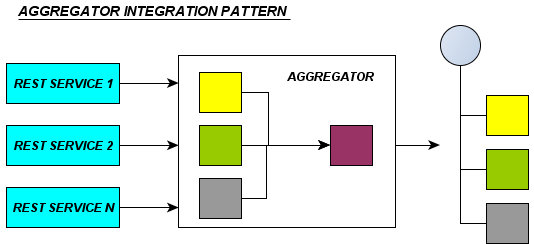
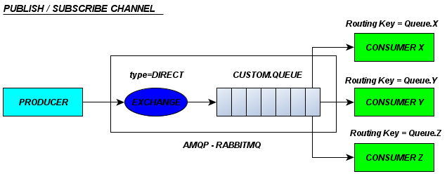
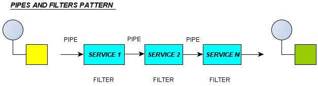

 #OC Integration Engine
=========================

**To build this project use**
_mvn install_

**To install this project** 
* Copy the application WAR on to a folder on the server.
* Download and copy the jetty-runner.jar file on the same folder as application WAR.
* Open command prompt and set the current working directory to the above folder location (where WAR and JAR has been placed).
* Run the following command - 
_java -jar jetty-runner.jar OCIntegration.war_

**To run a test on the project**
* Use Postman to invoke the rest service.

* For **URI Transformation**
For URI transformation (Clean API to Textured API and vice versa), we have built a camel route to pass the body payload and header parameters (pattern and replacement) to a bean which will then perform the pattern matching and replacement with the given string parameters.

*Test Steps*
	1. Select the "POST" method/verb.
	2. Add the url _http://localhost:8080/OCIntegration/OCIntegration_.
	3. Add the JSON Message in which you want to transform the URL.
	4. Also specify the "pattern" and "replacement" in header for the request.
	5. Submit the request by clicking on the "Send" button beside URL.

* For **Aggregation Pattern**
The [Aggregator](http://camel.apache.org/aggregator.html) Integration pattern from the Apache Camel EIP patterns allows you to combine the responses from multiple rest services, as shown in the figure below - 

*Test Steps*
	1. Select the "GET" method/verb.
	2. Add the url _http://localhost:8080/OCIntegration/OCIntegration_.
	3. Add the header "URIS" to the request and in value, add the comma separated list of the rest service URIs.
	4. Submit the request by clicking on the "Send" button beside URL.

* For **Publish/Subscribe Channel Pattern**
Camel supports the [Publish Subscribe Channel](http://camel.apache.org/publish-subscribe-channel.html) from the EIP patterns, that allows you to publish a message to a queue from where it can be read by multiple consumers who have subscribed for the activity/event. The AMQP product <a href="http://www.rabbitmq.com/" title="RabbitMQ">RabbitMQ</a> has been used for queue management. The figure below represents the implementation - 

*Test Steps*
	1. Select the "POST" method/verb.
	2. Add the url _http://localhost:8080/OCIntegration/OCIntegration/Publish_.
	3. Add the header "activity" to the request and in value, add the activity (Activity1, Activity2 or Activity3).
	4. Add some message in the body payload that you would want to be posted to the queue.
	5. Submit the request by clicking on the "Send" button beside URL.

* For **Pipes and Filters Pattern**
Camel supports the [Pipes and Filters](http://camel.apache.org/pipes-and-filters.html) pattern, which allows us to split the processing across multiple independent end-point instances which can then be chained together. We can create pipelines of logic using multiple end-point instances as follows -
  	

*Test Steps*
	1. Select the "POST" method/verb.
	2. Add the url _http://localhost:8080/OCIntegration/OCIntegration/Pipeline_.
	3. Add the "pattern" and "replacement" in header for the request.
	4. Add the header "activity" to the request and in value, add the activity (Activity1, Activity2 or Activity3).
	5. Add some message in the body payload that you would want to process.
	6. Submit the request by clicking on the "Send" button beside URL.