 

# Omnichannel-Infrastructure(Developer Guide)

## Introduction 


OmniChannel Infrastructure is a powerful framework that lets you write
single page client-side web application using latest UI technologies. It
helps in rapid UI development using state-of-art metamodel driven
approach to generate UI at runtime using various AngularJS components.

This document is intended for developers who want to learn and start
using OmniChannel platform. This document assumes that you have basic
understanding of HTML, CSS, JavaScript, AngularJs, npm, bower and task
runner grunt.

## Conceptual Overview 
##### OmniChannel Architecture 

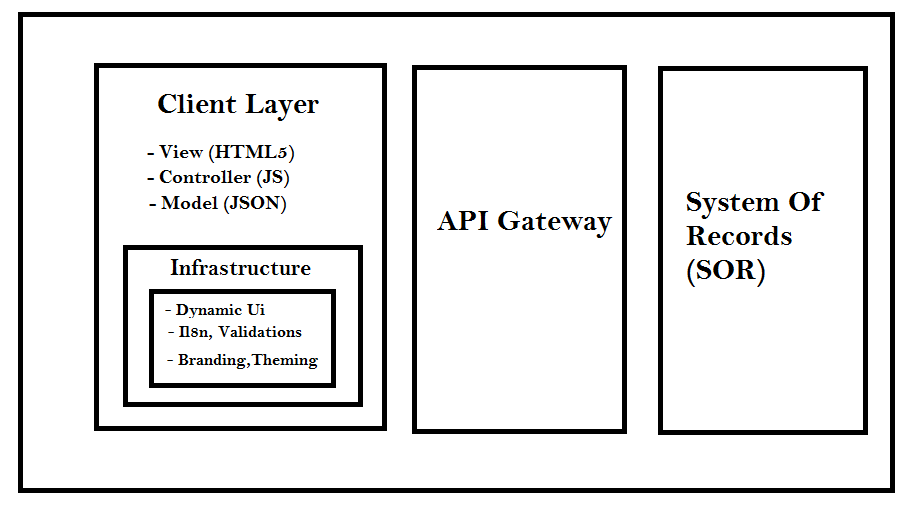

##### UI Layer as a System Of Interaction
 
  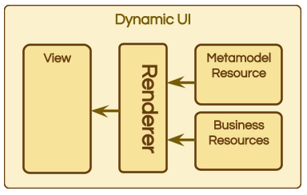

## Setup development Environment 
    
### Install required Softwares
##### Install Node.js and npm

  
  If Node.js and npm aren't already on your machine, install them.
 
  https://nodejs.org/en/download/ 
 
  To check which version you are using, run `node -v` and `npm -v` in a
  terminal window.
 
  If you need to run different versions of Node.js in your local
  environment, consider installing Node Version Manager (nvm) or Node
  Version Manager (nvm) for Windows.

#####  Browser  

  You can install any browser of your choice as AngularJS supports
  cross-browser compatibility. However, Google Chrome is recommended.

#####  IDE & Text Editor 

  In the programming world, there are two types of editors: full
  featured Integrated Development Environment (IDE) and lightweight text
  editors. Both allow for faster development workflow. The IDE and text
  editor we listed below are pretty good tools to speed up your Angular
  development. They can be easily configured for the Angular
  environment.
 
  Selecting anyone would be personal choice -
 
  Following are the recommended editors and IDEs-

-   WebStorm (not available for free)

-   Sublime Text (Most widely used, more plugins available )

-   Brackets (from Adobe)

-   Eclipse

-   Visual Studio

Online Editor:
 
  You can also use the following online editors for quickly checking
  your code -

-   plnkr.co

-   jsbin.com

#####  Install Git  

  The starter application demonstrated later relies on the use of the
  Git versioning system for source code management. You don't need to
  know anything about Git to follow the starter app other than how to
  install and run a few git commands.
 
  You need git in order to get
 
  You can download and install Git for Windows from
  http://git-scm.com/download. Once installed, you should have access to
  the git command line tool. The main commands that you will need to use
  are:
 
  `git clone` -  Clone a remote repository onto your local machine.
 
  `git checkout` - Check out a particular branch or a tagged version of
  the code to hack on.

Setting up Directory structure
--------------------------------------------------------------------------------

1.  Create an empty directory

2.  Create package.json to add all the packages we need to configure and
    setup the application

    Command - ` npm init `

    (More Info - https://docs.npmjs.com/files/package.json )

3.  Install following important packages

    Grunt ( ` npm install grunt –save -dev `)

    Bower ( `npm install bower –save -dev `)

  or add following entries in package.json
  
    ``` 
      "devDependencies": {
       "bower": "^1.4.1",
       "grunt": "~0.4.5",
       }
    ```
 
  And run npm install
 
  Running npm install will also automatically install packages and add
  it to a directory node\_modules

## Running the Development Web Server

1.  Install following npm package - grunt-contrib-connect or made an
    entry in devdependency in package.json and run 

   `npm install `

    ```
        `grunt-contrib-connect": "^1.0.2`
    ```
1.  Create and configure Gruntfile.js in the root directory and then
    register startServer task in it

    ```
      'use strict'; 
       module.exports = function(grunt) { 
       require('load-grunt-config')(grunt, { 
       data: { 
       pkg: grunt.file.readJSON('package.json') 
       } 
       }); 
    ```
    ``` 
    grunt.registerTask('startServer', [ 'connect:dev']);
    ```
1.  Create a grunt folder in your directory and create a connect.js then
    write the following code in this file.

     ```  
      'use strict'; 
       module.exports = { 
       dev:{ 
       options: { 
       port: 8080, 
       hostname: 'localhost', 
       keepalive: true, 
       livereload: true, 
       open: { 
       target: 'http://localhost:8080/index.html' 
       } 
       }, 
       } 
       }; 
      ```

1.  Add an index.html as the main file
    ```   
     <html>
        <body>
        </body>
     </html>
    ```
2.  Open git bash or command line from the root directory and run the
    command

    ` grunt startServer `
 
  this will set up local server on your machine and you should see a url
  “ http://localhost:8080/” opened on your default browser with the
  content that you have given in index.html

 ## Download framework code


  Following are the steps to download library and requried dependencies-
 
  1\. Create bower.json file by running command
 
  `bower init`
 
  2\. Add .bowerrc file where we will define the path where all the bower
  packages will get downloaded
 
  3\. Add following entry in dependencies section to get our framework code
    ``` 
       ocinfra :"https://<username>@github.csc.com/insurance/OcInfra.git#master"
    ``` 
  4\. Add other dependencies that our infrastructure needs
 ```
   "dependencies": { 
 
   "angular": "1.5.5", 
 
   "angular-bootstrap-colorpicker": "\~3.0.13", 
 
   "angular-dynamic-locale": "\~0.1.4", 
 
   "angular-translate": "\~2.10.0", 
 
   "angular-translate-loader-static-files": "\~2.10.0", 
 
   "angular-i18n": "1.3.15", 
 
   "angular-resource": "1.5.5", 
 
   "angular-sanitize": "1.5.5", 
 
   "angular-smart-table": "\~2.0.3", 
 
   "angular-route": "1.5.5", 
 
   "angular-cookies": "1.5.5", 
 
   "angular-ui": "0.4.0", 
 
   "angular-ui-select": "\~0.11.2", 
 
   "angular-ui-date": "\~0.0.8", 
 
   "angular-wizard": "\^0.6.1", 
 
   "bootbox": "4.4.0", 
 
   "bootstrap": "3.3.6", 
 
   "jasny-bootstrap": "3.1.0", 
 
   "font-awesome": "4.6.3", 
 
   "jquery-validation": "\~1.13.1", 
 
   "jquery-ui": "\~1.11.4", 
 
   "modernizr": "2.8.3", 
 
   "open-sans": "1.1.0", 
 
   "quick-ng-repeat": "0.0.1", 
 
   "select2": "3.5.2", 
 
   "angular-growl-v2": "0.7.9", 
 
   "angular-bootstrap-tour": "0.3.4-rc.2", 
 
   "angular-strap": "\~2.3.7", 
 
   "angular-bootstrap": "\~1.2.4", 
 
   "angular-ui-mask": "\~1.8.3", 
 
   "es6-shim": "0.35.1", 
 
   "angular-pdf": "\^1.3.0", 
 
   } 
  ```

##  Organizing directory structure  


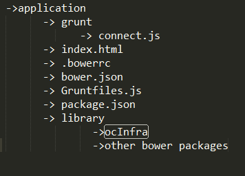

At the end we have following directory structure that involves

-   Grunt folder – to include all the grunt tasks

-   Index.html – main file of the application

-   bower.json – file that contains entries of all the required
    client-side packages

-   package.json – file that contains all the packages entries required
    to configure and set up application

-   library – folder generated automatically by bower as given in
    .bowerrc file

-   .bowerrc - configure the path in directory where all the bower
    packages will get downloaded
    ```
         { 
            "directory":"  library " 
         } 
    ```
  To use the concatenated and minified form of code you need to add four
  more grunt plugins namely –

-   'ngAnnotate'

-   'uglify'

-   'cssmin'

-   'copy'

 Register them in Gruntfiles.js with entry

    ` grunt.registerTask('dist',['ngAnnotate','uglify','cssmin','copy']);` 

  Configure all the grunt tasks –
 
  Find all the configurations of these four plugin in below link
 
  https://github.csc.com/smandal8/app-starter/tree/master/grunt 
 
  Run command -
 
    `grunt dist  `
 
  to get the minified form of code in root directory
 
  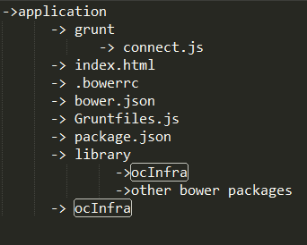
 
  Refrence the ocInfra code in application by adding following entries
  in index.html
    ```
    <script src=“ocInfra/js/ocInfra.js”></script>
    <script src=“ocInfra/css/ocInfra.css”></script> 
    ```
  To reference all other libraries in index.html automatically we need
  injector grunt plugin
 
  `grunt.registerTask('inject', ['injector','replace']); `
 
  Add injector.js and replace.js files inside grunt folder
 
  Find them at the below link
 
  https://github.csc.com/smandal8/app-starter/tree/master/grunt 
 
  Run command -
 
    `grunt inject `

  It will add following entries in index.html
 
  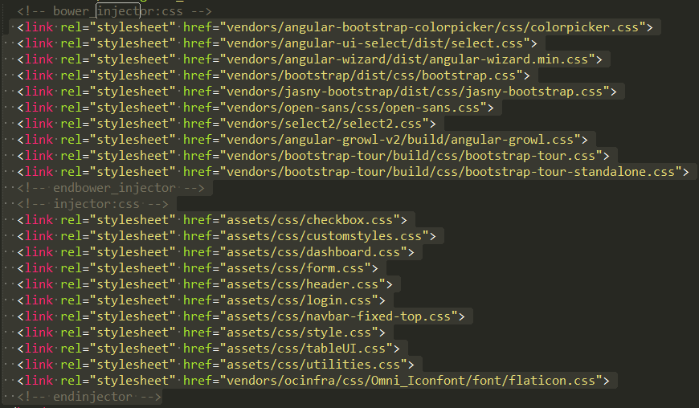
 
  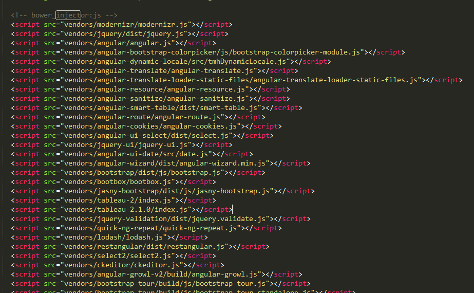
 
  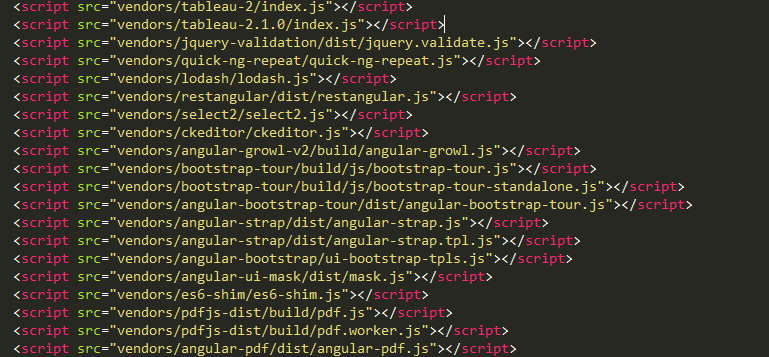

##  Add root element of your AngularJS application 


  The ng-app directive defines the root element of an AngularJS
  application. The ng-app directive will auto-bootstrap (automatically
  initialize) the application when a web page is loaded.
  
   ```
    <element ng-app=” modulename”>
    …
    </element>
   ```
Ex-

   ```
    <html ng-app=”app”>
        …
    </html>
   ```
##  Add an angular module 


  Every angular application need one root module that will be loaded
  into
  the [\$injector](https://docs.angularjs.org/api/auto/service/$injector) when
  the application is bootstrapped. It should contain the application
  code needed or have dependencies on other modules that will contain
  the code. 
 
  A module is created by using the AngularJS function  angular.module 
 
   
   ```
     // declare a module 
      var myAppModule = angular.module('myApp', []); 
   ```
-   The reference to myApp module in  &lt;div ng-app="myApp"&gt;.  This
    is what bootstraps the app using your module.

-   The empty array in angular.module('myApp', \[\]). This array is the
    list of modules myApp depends on.

##  Configure your application 

  Most applications typically have a config, containing things like:

-   The url of the API to communicate with

-   The base url of the application

-   App title

-   Default locations for css and templates etc...

To configure your application add appConf.json file -
 
Following are the important fields as shown below -
 
  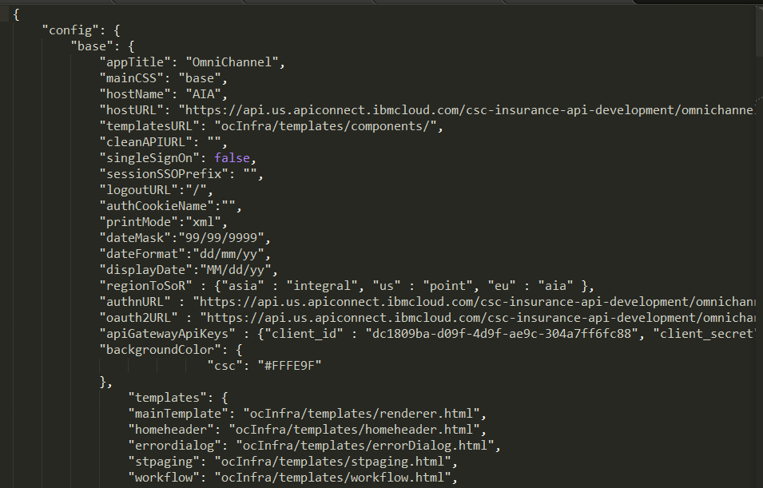

| Property        | Description           |
| ------------- |:-------------:|
| appTitle      |  Title of the application that will be shown in your browser tab. |
| mainCSS      |  Location of the specific theme related to your application      |
| hostname |  Reference name to the SOR (System Of Record)     |
| hostUrl      |  Absolute path to the SOR endpoint and all the URI paths must be added to it  |
| templatesURL      | Default location of all the templates to be used in application      |
| hostname |  Reference name to the SOR (System Of Record)     |
| cleanAPIURL      |  URL of cleanAPI |
| singleSignOn      | Allow API gateway connection to authenticate user without using login screens  |
| sessionSSOPrefix | In case singleSignOn is true it will append OmniChannel\_sso prefix to the entires in session storage.    |
| logoutURL      | In case singleSignOn is true it will redirect the user from application again back to logout stage. |
| authCookieName      |  In case singleSignOn is true, value will assign the name of cookies related to authorization to distinguish them among others  |
| printMode |  Printing document format xml or pdf   
| dateMask |   uimask configuration while entering your date
| dateFormat |   Format of the date supported by SOR teams
| displayDate |   Format of the date to be displayed on UI
| apiGatewayApiKeys |   Authentication keys to authenticate gateway
 
  
  
  

##  Configure your route  


-   Including the AngularJS Route Module source code in
    application’s HTML.

    ```
        <script src="https://ajax.googleapis.com/ajax/libs/angularjs/1.4.4/angular-route.js"></script> 
    ```
-   Very first step is to include the Javascript containing source code
    of routing module. Conventionally it is app.js

-   Include the ngRoute module as a dependency of our main AngularJS app
    module
    ```
     angular.module('myapp',['ngRoute']) 
    ```
    
-   Using ngView directive in index.html
  
    ```
        <div ng-view></div>
    ```
-   Configure \$routeProvider

    Define our routes in the config section using the
    ```
    \$routeProvider service.module.config(\['\$routeProvider',
    function(\$routeProvider){ 
     \$routeProvider 
     .when('/',{template:'This is the default Route'}) 
     .when('//:screenId',{template:'This is the 1st screen'}) 
     .when('//screen/:screenId',{template:'This is another screen'} 
     .otherwise({redirectTo:'/'}); 
     }\]); 
     ```
     Ex - 
     ```
       \$routeProvider. 
       when('/', { 
       templateUrl: function() { 
       return 'ocInfra/templates/components/screen.html'; 
       }, 
       controller: ScreenController 
       }). 
       when('/:screenId', { 
       templateUrl: function() { 
       return 'ocInfra/templates/components/screen.html'; 
       }, 
       controller: ScreenController 
       }). 
       when('/screen/:screenId', { 
       templateUrl: function() { 
       return 'ocInfra/templates/components/screen.html'; 
       }, 
       controller: ScreenController 
       }). 
       ```
 
  Name of the screenId should be the name of metamodel file which
  describes the view template for that particular url.
 
  In the next section we will discuss how to develop screens using
  metamodels.

## Developing Screens 
  

### Understanding Metamodels 

  OmniChannel projects metamodel are a set of json files specifying the
  layout and some features contained in the application screens,
  sections, or modals among others. The main key of this JSON objects is
  the \_metamodel\_ key. Every file would be therefore similar to this:
 
  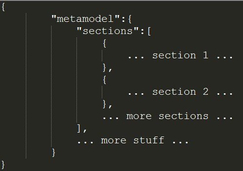
 
  Apart from the \_sections\_ element and all that comes with it, which
  are the basic elements to create the application screens, there are
  other objects/properties available within the \_metamodel\_ object.

####  Renderer metamodel 

  The renderer metamdel is made out of sections. Those sections are
  objects with different properties such as the title, the colspan, or
  the properties among others:

-   \_\_title\_\_: Text to display as the title of the section. A key
    contained in i18n file can be used also.

-   \_\_underline\_\_: Boolean representing whether or not the title
    should be underlined.

-   \_\_row\_\_: Number (1-based) of the row where the section will have
    to be placed. This allows the sections to not be correlatives, since
    you can define a section anywhere and then it will be inserted in
    the right row.

-   \_\_colspan\_\_: Number that represents the number of columns that
    the section will use. It uses bootstrap underneath, so the maximum
    colspan is 12. The minimum colspan is not 1, as it could be
    expected, but 3 because we do not want to allow more than 4 sections
    per row (more sections wouldn’t be user friendly since the content
    would be so small).

-   \_\_properties\_\_: Array containing json objects that define the
    content displayed within the section. The object attributes vary
    from one to another depending on the directive that is going to
    interpret them (table, input, etc.)

-   \_\_resourceUrl\_\_: This is intended to be used in the
    first screen. It represents the first API call when launching
    the application.

-   \_\_accordion\_\_: Flag that allows you to toggle content on the
    current section

-   \_\_collapse\_\_: Flag property of accordion that define if section
    is collapse by default or not


-   The renderer could include other renderer component. This is handled
    using a section type reference in the metamodel:

-   \_\_$ref and type\_\_: This twon properties allows to link antoher
    metamodel file that will be handled by another render instance.

  Example:
 
  

###  Renderer template 

  Based on the metamodel property type, the component will render
  different kind of sections:
 
  • Table : Including another custom directive in this section. In
  metamodel:
  
   ```
    { 
    
    "id": "quote:quote\_owner\_list", 
    
    "type": "table", 
    
    "metamodel": "quote\_owner\_list" 
    
    }  
   ```
-   id: Resource name to look for inside the API responses.

-   metamodel: Table metamodel file relative path.

  • Buttons : HTML Input type buttons. In metamodel:
     ```
       { 
     
       "type": "buttonGroup", 
     
       "buttons": [ 
     
       { 
     
       "icon": "fa-save", 
     
       "tooltip": "Save quote", 
     
       "action": "saveQuote" 
     
       } 
     
        ]  
     
      }  
     ```
  - icon: CSS class for icon
 
  - tooltip: Tooltip text. Could be a key existing in a locale file.
 
  - action: Action to execute onclick. This method has to be included in
  a custom factory and receives as a parameter the resource bound in the
  scope.
 
  • Pop up : Bootstrap modal window. \[Pop Up\]. 
In metamodels: 

    ```
    {
    "type": "popup", 
    
    "popup": { 
    
    "name": "editQuoteData", 
    
    "label": "_EDIT_QUOTE_DATA", 
    
    "metamodel": "quote_data", 
    
    }
    } 
    ```
  - name: name used to link the button with the modal window.
 
  - label: Button label
 
  - metamodel: Pop up metamodel file relative path.
 
  • Custom: Section used to include a custom html view.
    ```
    { 
    
    "id": "quote:quote_risk_list", 
    
    "metamodel": "quote_coverage_risk", 
    
    "type": "custom", 
    
    "templateUrl": "templates\coverage_template.html" 
    
    }  
    ```
  - id: Resource name to look for inside the API responses.
 
  - metamodel: Metamodel file relative path.
 
  - templateUrl: HTML view relative Path.
 
  Any other property type will be rendered using an input component.

###  Input metamodel  

   ```
    { 
    
    "id": "quote_automobile:ext_model", 
    
    "label": "_MODEL", 
    
    "type": "autocomplete", 
    
    "attributes": { 
    
    "maxlength": 40, 
    
    "capitalize": true 
    
    }, 
    
    "row": 2 
    
    } 
   ```
  The main keys present in the metamodel object are \`id\` and \`type\`.

-   \_\_Id\_\_: It is the identifier of the property in the backend. It
    is required for backend properties and the fact of not founding it
    into the API resource will avoid the rendering of the input.

-   The previous behaviour does not apply to the case of an
    UI-only field. In that case the id will represent the name of the
    property where the input will store its value.

-   \_\_Type\_\_: The type specified within the metamodel object is used
    to know which template we will need to render and, accordingly, the
    default configuration that has to be used in that input.

-   \_Since the rest of keys vary from one type to another, they will be
    explained in detail for every type of input.

###  Input metamodel structure 

-   \_\_Id\_\_: Explained \[here\](\#41-input-metamodel-example).

-   \_\_Type\_\_: Explained \[here\](\#41-input-metamodel-example).

-   \_\_Name\_\_: \_Optional\_. String to be used in the name HTML
    attribute of the input element. If not present, the \_id\_ will be
    used as name.

-   \_\_Label\_\_: \_Optional\_. String or i18n key to be used as the
    input label. If present it will use 4 bootstrap columns and if not
    present the input will span the whole space (12 columns).

-   \_\_Placeholder\_\_: \_Optional\_. String or i18n key to be used in
    the input's placeholder.

-   \_\_PatchOnBlur\_\_: \_Optional\_. Boolean flag that indicates
    whether or not we should patch a property when its value changes or
    when the input loses the focus. To know when the patch has to be
    triggered it uses the directive
    attribute \[\_update-mode\_\](\#41-input-directive-usage).

-   \_\_Visible\_\_: \_Optional\_. Boolean flag used to overwrite the
    input's visibility. By default the input is always visible.

-   \_\_VisibleWhen\_\_: \_Optional\_. Object that contains one or
    several expressions that will be evaluated in order to determine the
    visibility of the field.

-   \_\_Label-size\_\_: \_Optional\_. String that takes the value \_lg\_
    to enable bigger labels. In this case, they would span 8 columns
    instead of just 4.

-   \_\_Icon\_\_: \_Optional\_. As of today, used for the
    \_input-label.html\_ template to display an icon beside the value of
    the 'input'.

-   \_\_Format\_\_: \_Optional\_. String specifying the format for the
    dates when using an \_input-label\_. By default it gets the
    value \_dd/MM/yyyy\_.

-   \_\_Tooltip\_\_: \_Optional\_. String or i18n key to be used as the
    input's tooltip to help users.

-   \_\_Attributes\_\_: \_Optional\_. Object containing
    configuration attributes. They are different for the different types
    of inputs so they will be detailed within the sections below.

-   \_\_Options\_\_: \_Optional\_. Object containing method names to
    be used. Some types of inputs used them and some of them don't, so
    they will be detailed alongside the attributes for every type
    of input. Example
    ```
       { 
     
       "id": "quote_driver:name", 
     
       "label": "_LAST_NAME", 
     
       "type": "autocomplete", 
     
       "row": 1, 
     
       "options": { 
     
       "getData": "searchDriver", 
     
       "select": "selectDriver" 
     
       } 
     
       }, 
     
       { 
     
       "id": "quote_driver:first_name", 
     
       "type": "autocomplete", 
     
       "label": "_FIRSTNAME", 
     
       "attributes": { 
     
       "maxlength": 40, 
     
       "typeahead-wait-ms": 3000 
     
       }, 
     
       "row": 2 
     
       } 
    ```
###  Input metamodel attributes and options 

  This sections specifies the available properties within the
  \_attributes\_and \_options\_ objects of the metamodels.

 ####  Autocomplete 
 
 #####  Attributes 
 
 -   \_\_typeahead-wait-ms\_\_: Number. Minimum amount of milliseconds to
     wait before firing the search method to get the data that will have
     to be shown in the dropdown.
 
 -   \_\_typeahead-focus-first\_\_: Boolean. Whether or not the focus
     should be set on the first value of the dropdown.
 
 -   \_\_typeahead-min-length\_\_: Number. Minimum amout of characters
     that must be in the input in order to fire the search method.
 
 -   \_\_maxlength\_\_: Number. Maximum number of characters that the
     input can hold.
 
 -   \_\_capitalize\_\_: Boolean. Whether or not the values should be
     upper case. If it is false, then the dropdown values will be the
     same returned by the search method without any modification.
 
 #####   Options 
 
 -   \_\_getData\_\_: String. Name of the method that will be in charge
     of getting the data for the autocomplete’s dropdown. The directive
     infers a default behavior defining the following options:
 
 -   href: url to get the data for the autocomplete’s dropdown
 
 -   params: name of the parameter to include in the request
 
 -   \_\_select\_\_: String. Name of the method to use when a value of
     the dropdown has been selected. Again the directive cannot provide a
     default functionality in this case.
 
 -   \_\_typeaheadBlur\_\_: String. Name of the method to invoke when the
     typeahead loses the focus. By default, the method configures the
     dropdown to not be shown again, preventing this way the possibility
     that an asynchronous getData makes it displays when the user is no
     longer on that input. Please notice two things:
 
 
 
 -   The onUpdate (potentially the default patch on blur) method gets
     invoked first and then the typeaheadBlur gets invoked.
 
 -   Any method overriding this one may want to take care of hiding the
     dropdown as the default behavior does.
 
 -   \_\_typeaheadFocus\_\_: String. Name of the method to be invoked
     when the input gets the focus. The default functionality is to
     enable the dropdown to be shown (counteract the
     default typeaheadBlur).
 
 #####   Default values 
 
 | typeahead-wait-ms | typeahead-focus-first | typeahead-min-length |
 maxlength | capitalize |
 
 |-------------------|-----------------------|----------------------|-----------|------------|
 
 | 1000 | false | 3 | 9999999 | false |
 
 
 ####  Decimal 
 
 #####   Attributes 
 
 -   \_\_decimalPrecision\_\_: Number. Number of decimals after the
     decimal separator (dot).
 
 -   \_\_minimum\_\_: Number. Minimum possible value for the input. Any
     introduced value below this minimum will be set to the minimum.
 
 -   \_\_maximum\_\_: Number. Maximum possible value for the input. Any
     introduced value higher than this maximum will be set to the
     maximum value.
 
 #####   Options 
  
   &gt;\_None.\_
  
  #####  Default values 
 
 | decimalPrecision | minimum | maximum |
 
 |------------------|---------|---------|
 
 | 2 | 0 | 9999999 |
 
 ####  Money 
 
 #####   Attributes 
 
 -   \_\_currency\_\_: String. Short name of the currency icon that is
     going to be shown alongside the input. Possible currencies are:
     \_eur\_, \_usd\_, \_gbp\_, \_yen\_, \_rub\_ and \_won\_.
 
 -   Since this input holds decimal values, the attributes for the
     \[decimal input\](\#442-decimal) apply here.
 
 #####   Options 
  
   &gt;\_None.\_
  
 #####   Default values 
 
 | currency |
 
 |----------|
 
 | eur |
 
 ####  Email 
 
 #####   Attributes 
 
 -   \_\_maxLength\_\_: Number. Maximum amount of characters that the
     input can hold.
 
 #####   Options 
 
 &gt;\_None.\_
 
 #####   Default values 
 
 | maxLength |
 
 |-----------|
 
 | 9999999 |
 
 ####  Number 
 
 #####   Attributes 
 
 -   \_\_min\_\_: Number. Minimum number allowed.
 
 -   \_\_max\_\_: Number. Maximum number allowed.
 
 #####   Options 
  
   &gt;\_None.\_
  
 #####   Default values 
 
 | min | max |
 
 |-----|---------|
 
 | 0 | 9999999 |
 
 ####  Percentage 
 
 #####   Attributes 
 
 -   This type uses the same attributes as the
     \[decimal input\](\#442-decimal).
 
 #####   Options 
  
   &gt;\_None.\_
 
 ####  Select 
 
 #####   Attributes 
 
 -   \_\_capitalize\_\_: Boolean. Whether or not the values of the select
     and the selected value should be all upper case.
 
 #####   Options 
 
 -   \_\_getData\_\_: String. Name of the method that will be invoked to
     get the data that will be shown in the select dropdown. By default,
     the input fills the select with the values of the enum attribute
     present in the property it is bounded to.
 
 #####   Default values 
 
 | capitalize |
 
 |------------|
 
 | false |
 
 ####  TextMask 
 
 #####   Attributes 
 
 -   \_\_capitalize\_\_: Boolean. Whether or not the text should be
     transformed to upper case.
 
 -   \_\_mask\_\_: String. Pattern to mask the text with.
 
 #####   Options 
  
   &gt;\_None.\_
  
 #####  Default values 
 
 | capitalize | mask |
 
 |------------|----------------|
 
 | false | \_Empty string\_ |
 
 ####  Text 
 
 #####  Attributes 
 
 -   \_\_capitalize\_\_: Boolean. Whether or not the text should be
     transformed to upper case.
 
 -   \_\_maxLength\_\_: Number. Maximum number of characters that the
     input can hold.
 
 #####   Options 
  
   &gt;\_None.\_
  
 #####   Default values 
 
 | capitalize | maxlength |
 
 |------------|-----------|
 
 | false | 9999999 |
 
 ####  Textarea 
 
 #####   Attributes 
 
 -   \_\_maxLength\_\_: Number. Maximum number of characters that the
     input can hold.
 
 #####   Options 
  
   &gt;\_None.\_
 
 ##### Default values 
 
 | maxlength |
 
 |-----------|
 
 | 9999999 |
 
 ####  Toggle 
 
 ##### Attributes 
 
 -   \_\_true\_label\_\_: String. Text to be displayed alongside the
     ‘true’ value of the input. This text will be translated using the
     i18n resource files.
 
 -   \_\_false\_label\_\_: String. Counterpart of the true\_label but for
     the ‘false’ value of the input. The text will be translated using
     i18n resource files.
 
 ##### Options 
 
   &gt;\_None.\_
 
 ##### Default values 
 
 | true\_label | false\_label |
 
 |------------|-------------|
 
 | \_TRUE | \_FALSE |
 
 ####   Date  
 
 ##### Attributes 
 
 -   \_\_dateFormat\_\_: String. Format for the date (i.e: dd/MM/yyyy).
 
 -   \_\_startWeek\_\_: Number. Number representing the starting day of
     the week. 0 is Sunday, 1 is Monday, etc.
 
 -   \_\_trigger\_\_: String. Name of the event that shows
     the datepicker. Possible values are: click, hover, focus and manual.
 
 -   \_\_autoclose\_\_: Boolean. Whether or not the datepicker should be
     hidden after selecting a date.
 
 ##### Options 
 
   &gt;\_None.\_
 
 ##### Default values 
 
   | dateFormat | startWeek | trigger | autoclose |
  
   |------------|-----------|---------|-----------|
  
   | dd/MM/yyyy | 1 | focus | true |
 
 ####  Checkbox 
 
 ##### Attributes 
 
 -   \_\_postion\_\_: String. Defines the position of the checkbox and
     his label. If position is defined as "after". Checkbox position is
     shown before than label. By default is shown first label and second
     checkbox component.
 
 ##### Options 
 
   &gt;\_None.\_
 
 ####  Label 
 
   This type is not strictly an input since it only displays data.
   However, it is rendered by the input directive for simplicity. Due to
   the fact that it is going to render any type of data as a read-only
   field, it allows different parameters for customizing the label.
 
 ##### Attributes 
 
 -   \_\_icon\_\_: \_Font awesome\_ class used to show an image at the
     end of the label. I.e: EUR symbol.
 
 -   \_\_class\_\_: Class name used to add styling to the label.
 
 -   \_\_format\_\_: For dates only. Used to specify the date format. The
     backend metadata is used in order to determine whether or not the
     data is a date.
 
 ##### Options 
 
   &gt;\_None.\_
 
   
 
 ####  Range 
 
   This type displays two input components of any type. It has to be
   defined as a \_uiInput\_ and specify the properties of the range in
   the attributes section.
  
 #####   Attributes 
 
 -   \_\_range\_\_: Array of properties of the range.
 
   Example
     ```
     { 
     
     "id": "duration", 
     
     "label": "_DURATION", 
     
     "type": "range", 
     
     "uiInput": true, 
     
     "attributes": { 
     
     "range": [ 
     
     { 
     
     "id": "quote:start_date", 
     
     "type": "date", 
     
     }, 
     
     { 
     
     "id": "quote:end_date", 
     
     "label": "_TO", 
     
     "type": "date" 
     
     } 
     
     ] 
     
     }, 
     
     }, 
     ```
###  Table metamodel 

The metamodel definition by default is as follows, a metamodel element that could include the folowing attributes:

-   \_\_name\_\_: name to link the actions in the table and the
    popup component.

-   \_\_searching\_\_: flag to show the searching input at the top of
    the table.

-   \_\_pagination\_\_: flag to show the pagination footer.

-   \_\_header\_\_: flag to indicate whether the table has to shown a
    header or not.

-   \_\_buttons\_\_: object to indicate if there will be buttons at the
    bottom of the table.

-   \_\_label\_\_: label for the button that could be included at the
    bottom of the table to add a new item to the collection.

-   \_\_method\_\_: optional, name of the function in the custom factory
    that is going to overwrite the default action.

-   \_\_callback\_\_: optional, name of the function in the custom
    factory that is going to be executed after the default action.

-   \_\_values\_\_: optional, list of the possible buttons, a value for
    each button that also indicates the order to be displayed. Example:
    ```
       {  
     
       "buttons": { 
     
       "values": ["Syndic", "contact", "representative"] 
     
       } 
     
       } 
    ```
-   \_\_modalRef\_\_: metadata file relative path that includes the
    metadata definition for the popup.

-   \_\_filters\_\_: optional, valid values to filter the collection, a
    pair key/value that indicates the property and an array of
    possible values. For example:
    ```
       { 
     
       "filters": { "party_role:role_type": ["owner"] } 
     
       } 
    ```
-   \_\_properties\_\_: list of fields that the table is going to
    include, one for each table column.

  Example:
    ```
       { 
     
       "metamodel": { 
     
       "name":"quoteList", 
     
       "searching": true, 
     
       "pagination": "true", 
     
       "properties": [ 
     
       { 
     
       "id": "quote:product_id", 
     
       "label_header": "_PRODUCT_TYPE", 
     
       "type": "icon", 
     
       "width": "5%" 
     
       }, 
     
       { 
     
       "id": "quote:identifier", 
     
       "label_header": "_NUMBER", 
     
       "type": "label", 
     
       "align": "left", 
     
       "width": "10%" 
    ```
###  Table metamodel properties 

  Depending on the property type, its metadata definition can be
  slightly different. These are the common attributes:

-   \_\_id\_\_: Name of the backend property that will be displayed. In
    some cases, this property can be an array of names.

-   \_\_label\_header\_\_: Text or key in the i18n file representing the
    column header to use when there is not a header section specified
    for the table.

-   \_\_align\_\_: the align property value for the table column.

-   \_\_width\_\_: the width property value for the table column.

-   \_\_type\_\_: Text used to indicate the type of cell that will have
    to be displayed. Some possible values are explained in the
    folowing sections.

####    Table label  
 
  Label type used to display the value of the property specified in the
  \ id\  attribute that could be an array of ids. It would be also
  posible to specify an attribute \ format\ , for example 'dd/MM/YYYY'
  for a date.
 
  Example:
  
   
    
#### Table literal  
 
  Literal type used to render the \ id\  value directly in the table
  cell, it may be a text or key in the i18n file.
 
  Example:
   ```
    {
    
    "id": "_DRIVER",
    
    "label_header": "_ROLE",
    
    "type": "literal",
    
    "align": "left",
    
    "width": "10%"
    
    }
   ```
#### Table icon  
    
   ``` 
    { 
    
    "id": "quote:product_id", 
    
    "label_header": "_PRODUCT_TYPE", 
    
    "type": "icon", 
    
    "width": "5%" 
    
    } 
    
    ], 
    
    "iconList":  
    
    { 
    
    "MC011": "flaticon-car95",  
    
    "MD005": "flaticon-delivery50",  
    
    "MA002": "flaticon-motorbike",  
    
    "MC002": "flaticon-single17",  
    
    "IN005": "flaticon-home168",  
    
    "AX009": "flaticon-adults" 
    
    } 
    
    { 
    
    "label": "", 
    
    "type": "status", 
    
    "align": "center", 
    
    "width": "5%" 
    
    } 
   ```
#### Table Actions  
 
  Action type defines a list of actions to be included for each item in
  the table. It is required by every action to add an element in the
  \ options\  attribute containing the following fields:

-   \_\_value\_\_: the name of the action. The component provides two
    default actions that can be used:

-   edit: open the modal window with the item selected

-   delete: remove the item selected from the collection

-   \_\_title\_\_: optional, text that could be displayed as a link.

-   \_\_icon\_\_: optional, image of the action.

    -   \_\_method\_\_: optional, name of the function in the custom
        factory that is going to overwrite the default action, it
        receives as a parameter the resource selected.

    -   \_\_callback\_\_: optional, name of the function in the custom
        factory that is going to be executed after the default action.

  Example:
    ``` 
    { 
    
    "type": "actions", 
    
    "align": "left", 
    
    "width": "10%", 
    
    "options": [ 
    
    { 
    
    "value": "copy", 
    
    "title": "_COPY", 
    
    "icon": "fa fa-copy" 
    
    }, 
    
    { 
    
    "value": "edit", 
    
    "icon": "fa fa-edit", 
    
    "title": "_EDIT", 
    
    "method": "dashboardToQuote" 
    
    } 
    
    ] 
    
    } 
    ```
  Since the table uses the input renderer underneath, it could be
  possible to render in a cell any type allowed by the component, as
  well as any behavior allowed by it such as the patch of the property.

###  Pop up metamodel : 
   ```
       "name":"quote_owner", 
     
       "labels": { 
     
       "title": "_OWNER_POPUP", 
     
       "ok": "_SAVE", 
     
       "close": "_CLOSE" 
     
       }, 
     
       "sections": [ 
     
       { 
     
       "properties": [ 
     
       { 
     
       "id": "quote_owner:legal_classification", 
     
       "label": "_LEGAL_ACTIVITY_CLASS", 
     
       "type": "select", 
     
       "row": 2 
     
       } 
     
       ] 
     
       "actions":  
     
       { 
     
       "reset": { 
     
       "links":["quote_owner:person_link",
      "quote_owner:organization_link"], 
     
       "callback": "callbackQuoteOwner" 
     
       }, 
     
       "ok": { 
     
       "callback": "callbackQuoteOwner" 
     
       }, 
     
       "close": { 
     
       "callback" : "closeOwnerPopUp" 
     
       } 
     
       } 
     
       }]  
   ```
## How to add different components on screens quick reference by example  
  
###  Table 
    
   ```
     { 
    
     "id": "quotes", 
    
     "metamodel": "searchlist", 
    
     "type": "table" 
    
     } 
   ```
   
###  Popups 
   ```
       { 
     
       "type": "popup", 
     
       "row": 2,  
     
       "popup": {  
     
       "name": "offer", 
     
       "id": "quote:offer", 
     
       "label": "_ADD_CLAUSE", 
     
       "metamodel": "standard_clauses", 
     
       "method": "prepareClauseListPopup" 
     
       } 
     
       } 
   ```
   
###  Buttons 
   ```
     { 
    
     "type": "buttonGroup", 
    
     "buttons" : [ 
    
     { 
    
     "id":"btn_auto_quote_asia_create", 
    
     "method": "actionHandling", 
    
     "action": "create", 
    
     "label": "_CREATE_QUOTE", 
    
     "actionURL": "asia\screen\quotescreate" 
    
     } 
    
     ] 
    
     } 
   ```
###  Text 
   ```
     { 
    
     "id": "quote-additional-premium", 
    
     "type": "text", 
    
     "label": "_QUOTE_ADDITIONAL_PREMIUM", 
    
     "row": 1, 
    
     "colspan" : { 
    
     "xs":12, 
    
     "sm":6, 
    
     "md":6, 
    
     "lg":4 
    
     }, 
    
     "patchOnBlur": true 
    
     }, 
     
   ```
###  Label 
   ```
     { 
    
     "id": "quote-identifier", 
    
     "type": "label", 
    
     "labelClass":"labelfloat", 
    
     "label": "_QUOTE_IDENTIFIER", 
    
     "classInput": "col-xs-5 col-sm-5 col-md-5 col-lg-5 text-left", 
    
     "colspan" : { 
    
     "xs":12, 
    
     "sm":6, 
    
     "md":6, 
    
     "lg":4 
    
     }, 
    
     "row": 1 
    
     }, 
   ```
###  Image 
   ```
       { 
     
       "id": "gmailImage", 
     
       "type": "custom", 
     
       "templateUrl":
      "http://omnichannel-ui.mybluemix.net/ocInfra/templates/imageForSocialMedia.html"
      , 
     
       "imgurl":
      "http://omnichannel-ui.mybluemix.net/app-omnichannel/assets/images/google-plus.png"
      , 
     
       "method": "navigateToScreen", 
     
       "title":"Google Plus", 
     
       "colspan": { 
     
       "xs": 2, 
     
       "sm": 2, 
     
       "md": 2, 
     
       "lg": 2 
     
       }, 
     
       "actionURL": "/screen/dashboard" 
     
       }, 
   ```
###  Icon 
   ```
       { 
     
       "type": "groupicon", 
     
       "icons": [ 
     
       { 
     
       "id":"btn_auto_quote_asia", 
     
       "label": "_ASIA_AUTO_QS", 
     
       "class":"blue", 
     
       "method":"actionHandling", 
     
       "action": "create", 
     
       "resource": "quotes", 
     
       "actionURL" : "asiascreenquotescreate", 
     
       "order": "0", 
     
       "type": "tourstep", 
     
       "columnsize": 12 , 
     
       "title":"_ANONYMOUS", 
     
       "tourcontent":"_ANONYMOUS_AISA_CONTENT", 
     
       "iconflags":"malaysia", 
     
       "icon": "flaticon-auto3", 
     
       "colspan" : { 
     
       "xs":6, 
     
       "sm":6, 
     
       "md":6, 
     
       "lg":6 
     
       }, 
     
       "position":"top", 
     
       "showButton":true 
     
       },  
   ```
###  Date 
   ```
       { 
     
       "id": "quote-birth-date", 
     
       "type": "date", 
     
       "label": "\_DOB", 
     
       "patchOnBlur": true, 
     
       "colspan" : { 
     
       "xs":12, 
     
       "sm":6, 
     
       "md":6, 
     
       "lg":4 
     
       }, 
     
       "row": 2 
     
       } 
   ```
###  Radio-button 
   ```
       { 
     
       "id": "paymentMethod", 
     
       "type": "radio", 
     
       "label": "_PAYMENT_METHOD", 
     
       "row": 1, 
     
       "uiInput": true, 
     
       "classInput": "radioTemp", 
     
       "factoryName": "policywizardFactory", 
     
       "colspan": { 
     
       "xs": 12, 
     
       "sm": 6, 
     
       "md": 6, 
     
       "lg": 12 
     
       }, 
   ```
###  Checkbox 
   ```
       { 
     
       "id": "quote-homeLineBus-dwell-cov#1-opt-optVal", 
     
       "type": "checkbox", 
     
       "label": "_THEFT_DEDUCTIBLE", 
     
       "uiInput": true, 
     
       "colspan" : { 
     
       "xs":12, 
     
       "sm":6, 
     
       "md":4, 
     
       "lg":4 
     
       }, 
     
       "onUpdate": "saveProperty", 
     
       "row": 4 
     
       }, 
   ```
###  Dropdown 
   ```
       { 
     
       "id": "quote:product_id", 
     
       "type": "select", 
     
       "label": "_PRODUCT", 
     
       "row": 2, 
     
       "class":"padding-none", 
     
       "colspan" : { 
     
       "xs":12, 
     
       "sm":6, 
     
       "md":6, 
     
       "lg":4 
     
       }, 
     
       "uiInput" : true, 
     
       "value" : "MC011", 
     
       "options" : { 
     
       "getData" : "autoQuoteDropdown" 
     
       } 
     
       }, 
   ```
###  Custom templates 

   ```
       { 
     
       "metamodel": "login_content", 
     
       "type": "custom", 
     
       "templateUrl": "templates\login.html" 
     
       } 
   ```
## Add your own custom styles 

  Every application has its own design needs and requirements and that
  custom design can be added and referenced in the index.html
 
  Ex-
 
  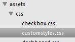
 
   &lt;link rel="stylesheet" href="assets/css/customstyles.css"&gt;  

## Add your own language locale 


  An important step of developing a web application or creating web
  content is making sure that it can be localized. You can use
   tmh.dynamicLocale  module to change the locale at run time, It
  changes the underlying \$locale object, so changing the locale will
  change the formatting of all elements that use  \$locale .
 
  Install it via npm or bower
 
   `npm install angular-dynamic-locale  `
 
   `bower install angular-dynamic-locale `
 
  To use, simply include it as a dependency in your app and you're done!
  
  ```
    angular.module('myApp', ['tmh.dynamicLocale']); 
  ```
  Example :
 
  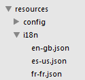
 
  You need to use these localization files and assign it to \$rootScope
  and then finally set the dynamic Locale
    
   ```
    \$resource('assets/resources/i18n/' + \$rootScope.newlocale     +
    '.json').get(function(data) { 
    
    \$rootScope.locale = data; 
    
    tmhDynamicLocale.set(\$rootScope.newlocale); 
    
    }, function() {}); 
    
   ``` 
  More Information please refer to app-omnichannel reference application
  –
 
  https://github.csc.com/insurance/omnichannel-ui/blob/master/src/app-omnichannel/app/app.js 
 
  https://github.csc.com/insurance/omnichannel-ui/tree/master/src/app-omnichannel/assets/resources/i18n 

## Add your custom behaviors and events using custom controllers and factories 


  You can add your custom behaviors using custom controllers and
  factories. Name of the factories should match the name of metamodels.
 
  Example :
 
  If we have metamodel with name anonymous.json and then factory should
  have name anonymousFactory.
 
  The name of methods inside factory should be given in method field
  inside metamodel files for ex-
 
  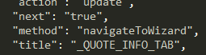
 
  This will associate the behavior for different events on the screen.
 
  Examples of custom factories can be found in app-starter application
  https://github.csc.com/smandal8/app-starter/blob/master/app/app.js 

###  OCInfra Refrence  
   
#### Components :  
     
  Onmichannel UI renderer is based on AngularJS directives, which will
  evolve to match the OmniChannel projects development needs. As of
  today, the rendering process is made thanks to the following
  directives (\_helper directives not included below\_):
 
  The source code for those directives is separated in two folders:
  \`src/ocInfra/js/components\` will hold directive controllers and
  \`src/ocInfra/templates/components\` will hold directive HTML
  templates:
 
  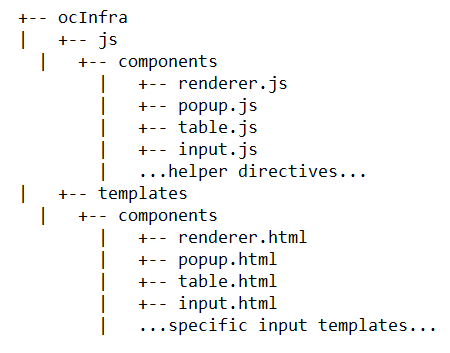

####   Renderer  

#####  Directive attributes:

-   metamodel: Metamodel file relative path.

-   factoryName: Custom Factory defined for custom screen actions.

-   resourceUrl: API resource (optional).

  Example:
    ``` 
    <div>
    
    <renderer metamodel=“screenId” factory-name=“screenId+‘Factory’”/>
    
    </div> 
    ```
####   Table renderer 

  The table renderer directive has an isolate scope and it is restricted
  to elements. The directive attributes are:

-   resourceUrl: API resource url containing the collection.

-   metamodel: Metamodel file relative path.

-   factoryName: Custom Factory defined for custom screen actions.

  Example:
    ``` 
    <table-render
    
    resource-url=“resourcesToBind[column.id].href”metamodel=“column.metamodel” factory-name=“factoryName”>
    
    </table-render>
    ```
####   Pop Up renderer 

  The popup renderer directive has an isolate scope and it is restricted
  to elements. Its scope option contains the following properties:

-   ui-id: modal window id selector.

-   metamodel: Metamodel file relative path.

-   factoryName: Custom Factory defined for custom screen actions.

-   resourceUrl: API resource (optional).

  Pop up code example:
``` 
    <popup-render
    
    ui-id=“modal_{{metamodelObject.name}}”metamodel=“metamodelObject.modalRef”               resource-url=“itemSelected.href” factory-name=“factoryName”>
    
    </popup-render>
```

#### Input renderer 

  The input directive is the component in charge of rendering properties
  (coming from backend or even if they are UI-only fields), setting the
  appropriate constraints when necessary (such as when the property is
  required or if it is editable or not among others). For that, this
  component uses 1 controller for all types of inputs, some directives
  for things such as formatting or decimal numbers, 1 input html
  template out of the set of templates available, and a metamodel
  defined in JSON format. Its distribution in the repository is as
  follows:

-   \_\_Directives and input controller\_\_: Under
    \`src/ocInfra/js/components\` you may find \_input.js\_,
    \_capitalize.js\_, \_decimal-input.js\_ and \_format-date.js\_.

-   \_\_HTML templates\_\_: Located under
    \`src/ocInfra/templates/components\` you may find several html
    templates prefixes with the word \_input\_ as well as
    \_backend-error-display.html\_ and \_help-tooltip-display.html\_,
    which are used to display errors and help tooltips respectively.

-   The input directive (\_input-render\_ HTML element) needs several
    entry parameters to be able to work and render the content properly.
    Those parameters are for example the metamodel of the input to
    render, the value from the backend, etc. Below the complete list of
    entry parameters as well as the reason for them to exist:

-   \_\_id\_\_: Due to the dynamic nature of the API, the identifier for
    the generated HTML element will not be known statically in some
    cases so the scope where the input directive is being used needs to
    pass this id to the directive.

-   \_\_property\_\_: This is the backend property that the input
    will display. If the input is going to be used to render an UI-only
    field, this property may be undefined.

-   \_\_metamodel\_\_: JSON object holding the necessary information for
    the rendering of the input, such as the type or configuration for
    the input.

-   \_\_update-mode\_\_: String used to indicate the directive the type
    of event to invoke the on-update callback (and potentially the
    default patch functionality). Possible values are \_blur\_
    (by default) and \_change\_.

-   \_\_on-update\_\_: String used to indicate the name of the method to
    be invoked when the input detects a change. This parameter allows
    the developers to add any custom behaviour after an input change.

-   \_\_base-url\_\_: String that specifies a path to the folder where
    the input templates are stored. By default it points to the
    templates folder specified \[here\](\#components), but if the
    developers need to create custom inputs not present in the ocInfra
    framework they can do it this way.

-   \_\_resources\_\_: Object that stores all the properties of the
    current scope that can be shown. This object is passed to the input
    directive because it may be necessary to create new properties under
    that object (i.e UI-only fields).

-   \_\_factory-name\_\_: String that specifies the name of the
    AngularJS factory holding the methods created by the developers.

  Code snippet
 
    ```
    <input-render id=“id”property=“resourcesToBind.properties[id]” metamodel=“column” update-mode="{{column.updateMode}}" on-update="{{column.onUpdate}}" base-url="{{column.baseUrl}}" resources=“resourcesToBind.properties” factory-name=“screenId+‘Factory’”></input-render> 
    ```

#### Factories 


| Name        | Description         
| ------------- |:-------------:
|TableMetaModel     | Similar to Metamodel factory but specifically used for Tables 
| ResourceFactory     | To make all the REST API calls with other important methods     
| pdfFactory |  Contains methods that helps us get and save pdf files   
| MetaModel | To load all the metamodels files in our scope and rootscope with other important methods
  
  
 
#### Directives 

         
| Name        | Description         
| ------------- |:-------------:
|renderer      |Top level angular directive that interprets the highest level metadata to display components
| inputRenderer      |The inputRenderer directive is the component in charge of rendering properties    
| popupRenderer |  popupRenderer directive is in charge of rendering popups
| tableRenderer |  tableRenderer directive is in charge of rendering tables
| capitalize |  Converts the letters into capitalcase
| decimalInput | It performs parsing of strings to convert them into floating point numbers
| formatDate |   It returns the date of particular given format
| ocLogodir |  It returns the CSC logo

  
  

#### Services 
| Name        | Description         
| ------------- |:-------------:
| LoginSrv |    It includes the methods to perform authentication
| OCInfraConfig |   To load the base configuration file

 

 

### OmniChannel Starter Application 
   
#### Overview 
    
  In This Chapter you will learn -

1.  How to create routes that can be handled by OcInfra.

2.  How to create metamodels and what all properties can be added .

3.  What configurations are needed to use in OcInfra.

4.  How to Integrate different/Multiple SOR

5.  How to use localization support.

6.  Where to write custom CSS.

7.  How to add application specific Images.

8.  How to add icons.

9.  How to support different regions

#### 1.   CREATE A SIMPLE “HELLO WORLD” APPLICATION WITH GRUNT AND CONNECT.JS 


1)  Create a folder and name it as  app-starter 

2)  Run  npm init  inside the folder and create a file named
     package.json .

3)  Add following dependencies in  package.json  then run  npm
    install .
    
   ```
      "connect-livereload": "\^0.6.0", 
    
      "grunt": "\^1.0.1", 
    
      "grunt-contrib-connect": "\^1.0.2" 
      
   ``` 
And add a node command in scripts section

   ``` 
      "scripts": { 
    
      "run": "grunt startServer" 
    
      } 
   ```
1)  Now create  gruntfile.js  and create a connect task to run server
    as following –


a)  In  gruntfile.js 

    ```
         'use strict'; 
    
         module.exports = function(grunt) { 
    
         require('load-grunt-config')(grunt, { 
    
         data: { 
    
         pkg: grunt.file.readJSON('package.json') 
    
         } 
    
         }); 
    
         grunt.registerTask('startServer', \[ 'connect:dev'\]); 
    
         }; 
    ```
b)  Create a folder named  grunt  and create  connect.js  file
    inside this folder. Write the following line of code inside
     connect.js 
     
    ```
        'use strict'; 
        
        module.exports = { 
        
        dev:{ 
        
        options: { 
        
        port: 8080, 
        
        hostname: 'localhost', 
        
        keepalive: true, 
        
        livereload: true, 
        
        open: { 
        
        target: 'http://localhost:8080/index.html' 
        
        } 
        
        }, 
        
        } 
        
        };
    
    ```

1)  Create a simple  index.html  file, with text, something like:

    “ Welcome in OcInra ”

2)  Run command –  `grunt startServer`  – either in  cmd  prompt or
     GitBash , from application’s root directory.

3)  You should see a URL “http://localhost:8080/” will be opened on your
    default browser with the content that you have given in index.html.

  You can also refer this code commit in app-starter repository, to see
  what we have written so far.
 
  https://github.csc.com/smandal8/app-starter/commit/f2ee03015ded23a4e8fd9bec4de9c23b793c9e3f?diff=unified 

#### ADD OCINFRA AND HELPER DEPENDENCIES IN APP-STARTER 


1)  Create a  bower.json  at application’s root level, add entry for
     OcInfra  in dependencies section as –
    
   ```
       {
   
       “OcInfra”:“https://<user_name>@github.csc.com/insurance /OcInfra.git#master”
   
       }
   ```
Where &lt; user\_name &gt; is your user name for github.csc.com

2)  You will need to add entries for the helper libraries that are
    required for  OcInfra 

3)  Now create a .bowerrc file at same level and add following code in
    same file .
    
   ```
       {
   
       "directory" : "lib\vendors",
   
       "analytics" : "false"
   
       }
       
   ```
In above code,  directory  is the path where dependencies will
    be downloaded.

4)  Now run bower install at the same level, either in  cmd  prompt or
     GitBash .

5)  You will be prompted to enter username and password
    of github.csc.com. Instead of password you have to enter token which
    is generated at github.csc.com.

6)  After entering correct username and token it will start downloading
    dependencies in “ lib/vendors ”.

 Please refer this code commit to see what we have done in this section.

  https://github.csc.com/smandal8/appstarter/commit/d1a42f311c9e0a26a51225f616493e8d58c64d82 

#### COPYING AND MINIFYING OCINFRA 

Add a grunt task to  Annotate ,  Minify  and  Copy  OcInfra
folder, as given

1)  Add following line of code in gruntfile.js –

   ` grunt.registerTask('dist',['ngAnnotate','uglify','CSSmin','copy']); `

2)  In grunt folder add the following files with code as below-


a)   ngAnnotate.js -

   ```
        module.exports = { 
   
        options: { 
   
        singleQuotes: true 
   
        }, 
   
        OcInfra: { 
   
        files: { 
   
        'tmp/js/OcInfra.js': ['lib/vendors/OcInfra/js/* .js'], 
   
        }, 
   
        }, 
   
        }; 
   ```
b)   uglify.js  –

   ```
        'use strict'; 
   
        module.exports = { 
   
        uglify: { 
   
        files: { 
   
        'tmp/js/OcInfra.min.js': ['tmp/js/OcInfra.js'] 
   
        } 
   
        } 
   
        }; 
   ```
c)   CSSmin.js  –

   ```
        'use strict'; 
   
        module.exports = { 
   
        concat : { 
   
        options: { 
   
        shorthandCompacting: false, 
   
        roundingPrecision: -1, 
   
        report : 'gzip' 
   
        }, 
   
        files: { 
   
        'tmp/CSS/OcInfra.CSS': ['lib/vendors/OcInfra/CSS/*.CSS'] 
   
        } 
   
        }, 
   
        CSSmin: { 
   
        files: [{ 
   
        expand: true, 
   
        cwd: 'tmp/CSS', 
   
        src: ['OcInfra.CSS', '!.min.CSS'], 
   
        dest: 'tmp/CSS', 
   
        ext: '.min.CSS' 
   
        }] 
   
        }  
   
        }; 
   ```
d)   copy.js  –

   ```
        'use strict'; 
   
        module.exports = { 
   
        dist : { 
   
        files: [ 
   
        { 
   
        expand: true , cwd:'tmp' , flatten: true, filter: 'isFile', 
   
        dest: 'OcInfra/js' , 
   
        src: ['js/*.js'] 
   
        }, 
   
        { 
   
        expand: true , cwd:'tmp/' , flatten: true, filter: 'isFile', 
   
        dest: 'OcInfra/CSS' , 
   
        src: ['CSS/*.CSS'] 
   
        }, 
   
        { 
   
        expand: true , cwd:'lib/vendors/OcInfra/' , flatten: false, filter:
       'isFile', 
   
        dest: 'OcInfra/' , 
   
        src: ['assets/'] 
   
        }, 
   
        { 
   
        expand: true , cwd:'lib/vendors/OcInfra/' , flatten: false, filter:
       'isFile', 
   
        dest: 'OcInfra/' , 
   
        src: ['templates/] 
   
        }, 
   
        ] 
   
        } 
   
        }; 
   ```
 

1)  Now run  grunt dist  command to  minify  and  copy  OcInfra
    from  lib/vendors  to application’s root directory.

2)  After running this command successfully, you should see a
     OcInfra  folder at root level which looks as-

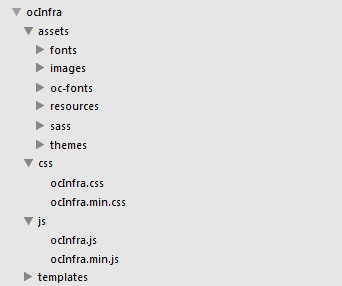

#### BUILDING FIRST SCREEN USING OCINFRA 
    

1)  Add dependencies references in  index.html . The libraries which
    need to be added in index.html can be referred in this
    section’s commit.

Update the line –
   ```
      <link rel=“stylesheet” href=“dist/CSS/OcInfra.CSS”>
   ```
   By –
   
   ```
    <link rel=“stylesheet” href=“OcInfra/CSS/OcInfra.CSS”>.
   ```
2)  Create a directory  assets  at root level, then create a
    configuration  file appConf.json  at
   ```    
        assets/resources/config/appConf.json 
   ```
   See description of appConf.json in  section - 6 

3)  Write a service -  LoadConfig  to read  appConf.json  from

   app/LoadConfig/LoadConfig.js .Then keep data in either \$scope or \$rootScope 
   
 1)  Create  app.js  at  app/app.js 
     
     a)  Define angular module and inject helper modules
     
     b)  Create  routes  for application
     
     c)  Initiate  translateProvider 
     
     d)  Write  app.run  method, define helper global variables, read
         locale file.
     
     
1)  You can add your own  CSS ,conventionally. We are adding CSS in
          assets/css/style.css 
     
     2)  You can add application specific  images  and reference it through
          metamodel , for ex we have added images at – assets/images/
     
     3)  Now add metamodel  anonymous.json . This metamodel is responsible
         to define layout of components of web page.
     
     To understand the properties of metamodel refer  section 8.1 
     
    In this anonymous metamodel we have added images, icons, CSS etc.

4)  Now add  flaticons  entry in bower.json as –

   ```
        "flaticon" :     "https://github.com/pboonlia/tikocon/archive/master.zip" 
   ```
5)  Now create en-gb.json file to support Locale at –

   ```
        assets/resources/i18n/en-gb.json 
   ```
And add following code –

   ```
        { 
   
        "_ASIA_AUTO_QS" : "Auto Quote Asia", 
   
        "_ANONYMOUS" : "Auto Quote Asia" 
   
        } 
   ```
These keys are also added in  metamodels  to generate Labels
on UI.

6)  Update connect.js’s target URL as –

   ```
        target: 'http://localhost:8080/#/ '
   ```
7)  Define as angular module “app” in index.html and add ng-view place
    holder as-

   ```
        <html ng-app=“app”> …………………… </html>
   
       <div ng-view ></div>
   ```

What we have done in this section can be refered by this commit –

  https://github.csc.com/smandal8/app-starter/commit/b7367c8e4b86d028b5ff9e09ad80f7b90701910a?diff=unified 
 
   now run 
  
  `grunt startServer`
  
  UI should be
  as below –

#### CREATING AN EMPTY WIZARD WITH NEW SCREEN 

1)  Let us update  anonymous.json . Add an entry to navigate to new
    page – “ quotesCreate ” it should navigate when “ Auto Quote
    Asia ” from anonymous page is clicked as-
   ```
        "actionURL" : "/asia/screen/quotesCreate" 
   ```
2)  Create a new route in  app.js  for new screen.

   ```
        when('/:regionId/screen/:screenId', { 
   
        templateUrl: function() { 
   
        return 'OcInfra/templates/components/screen.html'; 
   
        }, 
   
        controller: ScreenController 
   
        }); 
   ```
3)  There must a factory for every  screenId . We already have created
    an anonymous screen so now create
     anonymousFactory  conventionally. We had created this factory in
    app.js and created a method  actionHandling  inside this factory.
    This method name is also assigned in metamodel.

4)  Now create a new metamodel  quotesCreate.json  for new screen
    -“ quotesCreate ”

5)  In this metamodel we have defined  wizards . Every wizard should
    refer another metamodel (we are not defining these metamodels yet).

6)  Update en-gb.json file to support locale for newly added Labels –

Add following entries-

   ```
        "_ANONYMOUS" : "Auto Quote Asia", 
   
        "_OWNER_INFO_TAB": "Owner Info", 
   
        "_RISK_INFO_TAB": "Risk Info", 
   
        "_ADDITIONAL_INFO_TAB": "Additional Info", 
   
        "_PREMIUM_INFO_TAB": "Premium Info", 
   
        "_RISK_INFO_TAB": "Risk Info" 
   ```
Refer this commit to see code changes for these section.

 https://github.csc.com/smandal8/app-starter/commit/66acdfaa724976c5ae7f94450b48b0d5d9f7422f?diff=unified 

Now stop your server and run it again using  grunt startServer .

quotesCreate screen should look like this-

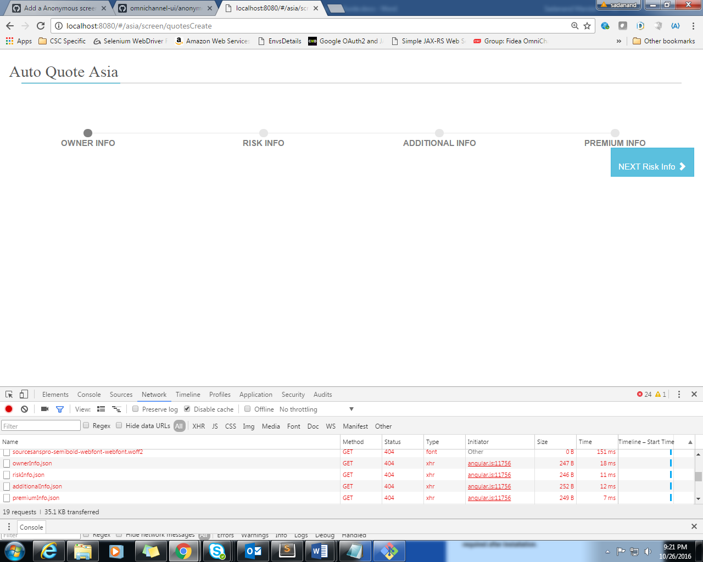

These wizards should look empty, and you can navigate to next wizard by
clicking on Next button.

#### ADD COMPLETE WIZARDS TO QUOTESCREATE SCREEN  


1)  Create  Metamodel  for wizards-

2)  Add following  metamodels  that are referenced in
     quotesCreate . json 

i.   additionalInfo.json 

ii.  ownerInfo.json 

iii.  premiumInfo.json 

iv.  riskInfo.json 

3)  Create  quotesCreateFactory  factory and write
     navigateToWizard  method in this factory.

4)  Add these values in  en-gb.json  to support localization in newly
    added  metamodel .
    
   ```
        "_RISK_INFO_TAB": "Risk Info", 
   
        "_QUOTE_ADDITIONAL_PREMIUM": "Additional Premium", 
   
        "_QUOTE_ADDITIONAL_COVER": "Additional Cover", 
   
        "_QUOTE_ADDITIONAL_LIMIT": "Additional Limit", 
   
        "_QUOTE_PARTY_TYPE": "Party Type", 
   
        "_QUOTE_FULL_NAME": "Full Name", 
   
        "_GENDER": "Gender", 
   
        "_DOB": "Date of Birth", 
   
        "_QUOTE_IDENTIFIER": "Identifier", 
   
        "_QUOTE_ANNUAL_COST": "Annual Cost", 
   
        "_QUOTE_VEHICLE_USE": "Vehicle Use", 
   
        "_QUOTE_SUM_INSURED": "Sum Insured", 
   
        "_QUOTE_YEAR_OF_REGISTRATION": "Year of Registration", 
   
       "\QUOTE\MAKE\OF\VEHICLE": "Make/Model", 
   
        "\QUOTE\COMMENCEMENT\DATE": "Commencement Date", 
   
        "\QUOTE\ENGINE\CAPACITY": "Engine Capacity", 
   
        "\QUOTE\GEOGRAPHIC\LOCATION": "Geographic Location", 
   
        "\QUOTE\DRIVER\NAME": "Driver Name", 
   
        "\QUOTE\COVER": "Quote Cover", 
   
        "\QUOTE\DRIVER\GENDER": "Driver Gender", 
   
        "\QUOTE\NCD\PERCENTAGE": "NCD Percentage", 
   
        "\QUOTE\PERMITTED\DRIVER": "Permitted Driver" 
   ```
   
  Refer this commit to see what have achieved in this section
 
  https://github.csc.com/smandal8/app-starter/commit/f5877215360b3dc47c318e26f16c833f3c9537c7?diff=unified 
 
  Now run your application with command –  
  
  `grunt startServer `
 
  From anonymous page navigate to  quotesCreate  screen, you should
  see UI as –
 
  
 
  Now fill all the inputs in current screen and click Next button.
 
  Finally your application structure should look like this –
 
  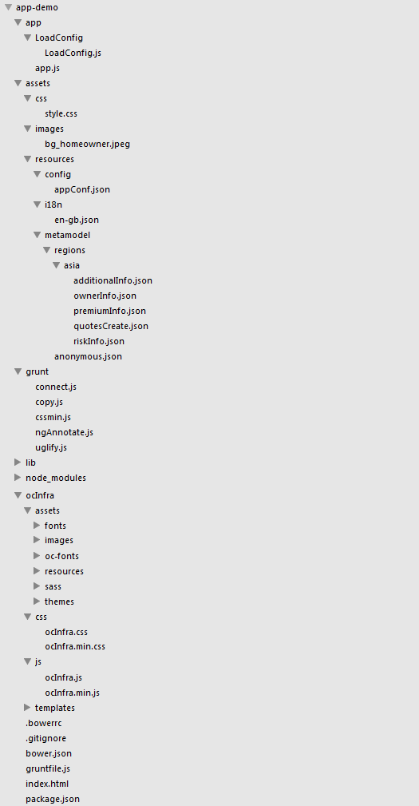
 
  You can checkout this entire repo from
  https://github.csc.com/smandal8/app-starter 
 
  Run following command to clone this repo –
 
   `git clone https://github.csc.com/smandal8/app-starter.git  `
 
  Then run the following commands in sequence –

1) ` npm install`

2)  `bower install`

3)  `grunt dist`

4)  `grunt startServer`

  After these commands, an application should launch on your default
  browser.
  
 #### ADD Search panel and SearchList for Quotes.
 Till now we have build the capability to create a quote using wizard, now we are going to implement a functionality from where someone can find created/existing quote or can see list of quotes.
 Lets create a new tile at anonymous page from where user can navigate to quotesSearch and quotesList page.
 
 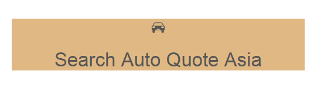
 
 Now add locale support for quote search and quotes list page.
 Add following attributes in **en-gb.json**
 ```
  "_ASIA_AUTO_QS_CREATE" : "Create Auto Quote Asia",
 "_ASIA_AUTO_QS_SEARCH" : "Search Auto Quote Asia",
 "_QUOTE_PERMITTED_DRIVER": "Permitted Driver",
 "_PRODUCT_ID": "Product ID",
 "_RISK_HOLDER": "Risk Holder",
 "_QUOTE_NUMBER": "Quote Number",
 "_DISTRIBUTOR_ID": "Distributor ID",
 "_SEARCH": "Search",
 "_RESET": "Reset",
 "_RESULTS": "Results",
 "_FILTER_RESULTS": "Enter text to filter results ...",
 "_PRODUCT_ID": "Product ID",
 "_NAME": "Name",
 "_QUOTE_TYPE": "Quote Type",
 "_DISTRIBUTOR_ID": "Distributor ID",
 "_RISK_DATA": "Risk Data",
 "_Effective_Date": "Effective Date",
 "_NUMBER": "Number",
 "_ACTION": "Action"
```

Now create a factory "quotesSearchFactory" in app.js
Please refer following commit to check what we have implemeted in this section.
https://github.csc.com/smandal8/app-starter/commit/8a0f6d4638ec74c38bfa88f8feedc572c68463d1

Lets add metamodel files for quotesSearch.json and searchList.json
Please follow this commit and check this metamodel files.
https://github.csc.com/smandal8/app-starter/commit/1310c9760516f06ea4ca0666babdd15e737c90bb
 
 
 
 
 
