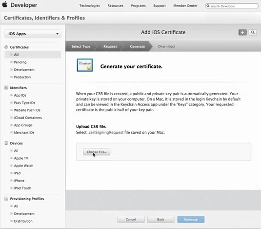

# Event Driven API Infrastructure Guide 

>   Version 1.0.0

1. Introduction
============

Push Notifications are a very powerful, content driven and user centric mobile
application feature which can deliver the content and notify the user without
the user opening the app explicitly. The notifications can be pushed to a mobile
application either targeting a specific user and even can serve as a broadcast
to all the users.

This document is shows the end-to-end integration of Push Notifications to the
OmniChannel Platform. The integration is divided into following layers:

-   SOR API’s

-   Subscription Service

-   Publish Service

-   Notification Provider and

-   Mobile Application

1.1  Conceptual Overview
-----------------------------------

**OmniChannel Event Driven API Architecture**


The above architecture diagram represents the logical flow and interaction
between all the omnichannel event driven components.

2. Subscription Service
====================

The notification subscription service serves the purpose of getting the
information from the SOR and save the corresponding subscription parameters
pushed from SOR into a Subscription Registry. The Publish Service and the Event
Queue to send the notification to the Notification Provider later use the values
saved in Subscription Registry.

The event flow of the Subscription Service can be seen in the Flow Chart below:

2.1 Subscription Service Flow Chart
-----------------------------------


2.2 Sample Subscription API call
--------------------------------

>   Here is the sample api call that shows the subscription of a user id:
>   kkdrensk to a particular policy.

>   **URL**: <http://oci.mybluemix.net/subscribe>

>   **Method**: POST

>   **Sample POST Body**:

>   { "uid" : "kkdrensk", "uri" :
>   "http://208.43.105.244:7070/ux-point-api/policies/ID-HP+000898700050005YXL"
>   }

>   In the above POST Body, **uid** is the name of the agent who want to
>   subscribe to the policy changes and **uri** is the policy uri from the SOR
>   that needs the subscription attention.

3. Publish Service:
================

The notification publish service serves the purpose of pushing the policy change
status to the Notification Provider, which in turn pushes the notification to
the Mobile Application. The SOR listens to the resource change. Once a change is
detected it pushes the changes to the Notification Service with the changed uri
and the optional data.

The flow of the Publish Service can be seen in the flow chart below:

3.1 Publish Service Flow Chart
--------------------------


3.2 Sample Publish API call
-----------------------------------

-   Here is the sample api call that shows the publish message to the
    Notification Provider.

-   **URL**: http://oci.mybluemix.net/publish/

    **Method**: POST

    **Sample POST Body**:

    { "msg": "Test Message", "identifier": "HP+000898700050005YHP", "event":
    "Cancellation", "proxy":
    "http://208.43.105.244:7070/ux-point-api/policies/ID-HP+000898700050005YHP"
    }

>   In the above POST Body, **msg** is the message that will be pushed to the
>   Mobile Application as a message while others are the extra payloads that
>   will be sent as a push notification

4. Push Notifications
==================

IBM Push Notifications is a service that you can use to send notifications to
iOS and Android mobile devices, to Google Chrome and Mozilla Firefox web
browsers and also to Google Chrome Apps and Extensions. Notifications can be
targeted to all application users or to a specific set of users and devices
using tags.

4.1 Push Notification Service Process
-------------------------------------

Mobile, Web browser clients and Google Chrome Apps and Extensions can subscribe
and register for the Push Notifications service. On startup, the client
applications will register and subscribe themselves to the Push Notifications
service. The notifications are dispatched to the Apple Push Notification Service
(APNs) or Firebase Cloud Messaging (FCM)/Google Cloud Messaging (GCM) server and
then sent to registered mobile or browser clients.


4.1.1. Creating a Push Notification Service on Bluemix
-------------------------------------------------------

-   To create a Push Notification Service on BlueMix, click on the link below
    and login:

-   [BlueMix Console](https://console.ng.bluemix.net/)

    To have an access to the CSC Insurance Org and the corresponding space,
    please drop a mail to Faisal Siddiqui with justification for the access to
    the Org.

    Once access is granted, navigate to the Dashboard and from the Catalog
    search for the Push Service.

    

    

    Provide the valid Service name and credential names and click “Create” to
    create a new Push Service. Once created, navigate to the Configure section
    on the Push Service that is created.

    

    In the Configure section, the Push Credentials for APNS(Apple Push
    Notification Service) for Apple devices and GCM(Google Cloud
    Messaging)/FCM(Firebase Cloud Messaging) credentials have to be configured.

4.1.2. Configuring credentials for APNs
----------------------------------------

Apple Push Notification Service (APNs) allows application developers to send
remote notifications from the Push Notification service instance on Bluemix (the
provider) to iOS devices and applications. Messages are sent to a target
application on the device.

Obtain and configure your APNs credentials. The APNs certificates are securely
managed by Push Notification service and used to connect to APNs server as a
provider.

**Registering an App ID**

The App ID (the bundle identifier) is a unique identifier that identifies a
specific application. Each application requires an App ID. Services like the
Push Notification service are configured to the App ID.

-  Make sure you have an [Apple
    Developers](https://developer.apple.com/) account.

-  Go to the [Apple Developer](https://developer.apple.com/) portal,
    click **Member Center**, and select **Certificates, Identifiers &
    Profiles**.

-  Go to the **Registering App IDs** section in the [Apple Developer
    Library](https://developer.apple.com/library/mac/documentation/IDEs/Conceptual/AppDistributionGuide/MaintainingProfiles/MaintainingProfiles.html#//apple_ref/doc/uid/TP40012582-CH30-SW991),
    and follow the instructions to register the App ID.

-   When you register an App ID, select the following options:

-   Push Notifications

  

-   Explicit ID

   

-   Create a development and distribution APNs SSL certificate.

-   **Create a development and distribution APNs SSL certificate**

-   Before you can obtain an APNs certificate, you must first generate a
    certificate signing request (CSR) and submit it to Apple, the certificate
    authority (CA). The CSR contains information that identifies your company
    and your public and private key that you use to sign for your Apple push
    notifications. Then, generate the SSL certificate on the iOS Developer
    Portal. The certificate, along with its public and private key, is stored in
    Keychain Access.

    You can use APNs in two modes:

-   Sandbox mode for development and testing.

-   Production mode when distributing applications through the App Store (or
    other enterprise distribution mechanisms).

-   You must obtain separate certificates for your development and distribution
    environments. The certificates are associated with an App ID for the app
    that is the recipient of remote notifications. For production, you can
    create up to two certificates. Bluemix uses the certificates to establish an
    SSL connection with APNs.

-  Go to the [Apple Developer](https://developer.apple.com/) website,
    click **Member Center**, and select **Certificates, Identifiers &
    Profiles**.

- In the **Identifiers** area, click **App IDs**.

-  From your list of App IDs, select your App ID, then select **Settings**.

-  In the **Push Notifications** area, create a Development SSL certificate and
    then a Production SSL certificate.

  

-  When the **About Creating a Certificate Signing Request (CSR)
    screen** displays, start the **Keychain Access** application on your Mac to
    create a Certificate Signing Request (CSR).

-  From the menu, select **Keychain Access \> Certificate Assistant \> Request
    a Certificate From a Certificate Authority…**

-  In **Certificate Information**, enter the email address that is associated
    with your App Developer account and a common name. Give a meaningful name
    that helps you identify whether it is a certificate for development
    (sandbox) or distribution (production); for
    example, *sandbox-apns-certificate* or *production-apns-certificate*.

-  Select **Save to disk** to download the .certSigningRequest file to your
    desktop, then click **Continue**.

-  In the **Save As** menu option, name the .certSigningRequest file and
    click **Save**.

-  Click **Done**. You now have a CSR.

-  Return to the **About Creating a Certificate Siging Request (CSR)** window
    and click **Continue**.

-  From the **Generate** screen, click **Choose File ...** and select the CSR
    file that you saved on your desktop. Then, click **Generate**. 

  

-  When your certificate is ready, click **Done**.

-  On the **Push Notifications** screen, click **Download** to download your
    certificate, then click **Done**.

  

-  On your Mac, go to **Keychain Access \> My Certificates**, and locate your
    newly installed certificate. Double-click the certificate to install it into
    the Keychain Access.

-  Select the certificate and private key, and then select **Export** to
    convert the certificate into the personal information exchange format
    (.p12 format). 

  

-  In the **Save As** field, provide the certificate a meaningful name. For
    example, sandbox\_apns.p12\_certifcate or production\_apns.p12, then
    click **Save**.

  

-  In the **Enter a password** field, enter a password to protect the exported
    items, then click **OK**. You can use this password to configure your APNs
    settings on the Push dashboard.

 

-  The **Key Access.app** prompts you to export your key from
    the **Keychain** screen. Enter your administrative password for your Mac to
    allow your system to export these items, and then select the **Always
    Allow** option. A .p12 certificate is generated on your desktop.

  **Creating a development provisioning profile**

-   The provisioning profile works with the App ID to determine which devices
    can install and run your app and which services your app can access. For
    each App ID, you create two provisioning profiles: one for development and
    the other for distribution. Xcode uses the development provisioning profile
    to determine which developers are allowed to build the application and which
    devices are allowed to be tested on the application.

    **Before you begin**

    Make sure you have registered an App ID, enabled it for Push Notification
    Service, and configured it to use a development and production APNs SSL
    certificate.

    Create a development provisioning profile, as follows:

-  Go to the [Apple Developer](https://developer.apple.com/) portal,
    click **Member Center**, and select **Certificates, Identifiers &
    Profiles**.

-  Go to the [Mac Developer
    Library ](https://developer.apple.com/library/mac/documentation/IDEs/Conceptual/AppDistributionGuide/MaintainingProfiles/MaintainingProfiles.html#//apple_ref/doc/uid/TP40012582-CH30-SW62site),
    scroll to the **Creating Development Provisioning Profiles** section, and
    follow the instructions to create a development profile. **Note**: When you
    configure a development provision profile, select the following options:

    -   **iOS App Development**

    -   **For iOS and watchOS apps**

    -   **Creating a store distribution provisioning profile**

    -   {: \#create-push-credentials-apns-distribute\_profile}

        Use the store provisioning profile to submit your app for distribution
        to the App Store.

-  Go to the [Apple Developer](https://developer.apple.com/) portal,
    click **Member Center**, and select **Certificates, Identifiers &
    Profiles**.

-  Double-click the downloaded provisioning profile to install it into Xcode.

-   **Setting up APNs on the Push Notification Dashboard**

-   To use the Push Notification service to send notifications, upload the SSL
    certificates that are required for Apple Push Notification Service (APNs).
    You can also use the REST API to upload an APNs certificate.

    **Before you begin**

    The certificates that are needed for APNs are .p12 certificates, which
    contain the private key and SSL certificates that are required to build and
    publish your application. You must generate the certificates from the Member
    Center of the Apple Developer website (for which a valid Apple Developer
    account is required). Separate certificates are required for the development
    environment (sandbox) and the production (distribution) environment.

    **Note**: After the .cer file is in your key chain access, export it to your
    computer to create a .p12 certificate.

    For more information about using the APNs, see [iOS Developer Library: Local
    and Push Notification Programming
    Guide](https://developer.apple.com/library/ios/documentation/NetworkingInternet/Conceptual/RemoteNotificationsPG/Chapters/ProvisioningDevelopment.html#//apple_ref/doc/uid/TP40008194-CH104-SW4).

    To set up APNs on the Push Notification services dashboard, complete the
    steps:

-  Select **Configure** on the Push Notification services dashboard.

-  Choose the **Mobile** option to update the information in the **APNs Push
    Credentials** form.

-  Select **Sandbox** (development) or **Production** (distribution) as
    appropriate and then upload the p.12 certificate that you created using the
    previous step.

  

-  In the **Password** field, enter the password that is associated with
    the .p12 certificate file, then click **Save**.

-   After the certificates are uploaded successfully with a valid password, you
    can start sending notifications.

4.1.3. Configuring credentials for FCM
---------------------------------------

Firebase Cloud Messaging (FCM) is the gateway used to deliver push notifications
to Android devices, Google Chrome and Mozilla web browsers. FCM has replaced
Google Cloud Messaging (GCM). You need to get your FCM credentials, and then set
up the Push Notification servicssse on the dashboard. Ensure that you use FCM
configurations for new apps. Existing apps can continue to function with the GCM
configurations.

**Getting Your Sender ID and API key**

The API key is stored securely and used by the Push Notification service to
connect to the FCM server and the sender ID (project number) is used by the
Android SDK on the client side.

To setup the FCM, generate the API key and Sender ID, complete the steps:

-  Visit the [Firebase Console](https://console.firebase.google.com/?pli=1).

-  Select **Create new project**.

-  In the Create a project window, provide a project name, choose a
    country/region and click **Create project**.

-  In the navigation pane, click the Settings icon and select **Project
    settings**.

-  Choose the Cloud Messaging tab to generate a Server API Key and a Sender ID.

**Setting up Push Notification service for Android**

**Note:** You will need your FCM/GCM API Key and Sender ID (project number).

-  Open your Bluemix dashboard and then click the Push Notification Bluemix
    service instance you have created, to open the dashboard. The Push dashboard
    is displayed. To set up an unbound Push Notification service for Android,
    select the Unbound Push Notification service icon to open the Push
    Notification service dashboard.

-  Click the Push Service is created earlier, to configure the FCM/GCM
    credentials for Android applications and Google Chrome Apps and Extensions.

-  On the **Configuration** page, for Android, go to the **Mobile** tab and
    configure the Sender ID (GCM project number) and API Key.

Click **Save**.

5. Mobile Apps
===============

OmniChannel apps uses Apache Cordova as a wrapper for the Native Mobile API
support. To create the Cordova application and to add the corresponding plugins,
a Readme file has been provided in the mobile-infrastructure/mobile folder. The
automated scripts which are combination of shell scripts and grunt scripts
creates the Cordova application, gets the code from the OmniChannel app and
packages it as a mobile application.

**Prerequisites:**

To create a mobile application using Cordova, the following software have to be
installed and configured:

-   Cordova

-   [Xcode](https://developer.apple.com/library/content/documentation/IDEs/Conceptual/AppStoreDistributionTutorial/Setup/Setup.html)

    -   Development environment for iOS devices. Can be installed only on Mac OS

-   [Android Studio](https://developer.android.com/studio/install.html) -
    Development environment for Android devices. Can be installed on both Mac OS
    and Windows

-   [Cygwin](https://www.cygwin.com/) – To run the shell scripts on Windows. Not
    required for Mac OS

The following steps gives the step by step procedure on creating the Cordova
project and configuring it to receive Push Notifications on iOS/Android device:

-  Execute the shell script using command from terminal/cmd prompt **sh
    configcordova.sh create**. This creates the cordova project and add all the
    plugins required for receiving push notifications.

-  Navigate to mobile folder and open the **mobileConf.json**. From the Bluemix
    console, the route and app GUID values are displayed at the start of the
    details page for your app. Copy these values and replace the existing
    **pushroute** and **pushguid** values in the json file.

-  Execute the shell script using command from terminal/cmd prompt **sh
    configcordova.sh addresources**. This adds the resources to the cordova
    project along with the push configuration files into the Cordova project.

The above steps create an iOS package and Android package with the latest
omnichannel code and configure the push credentials to the project.

### Configuring XCode to receive Push Notifications:

-  Open your your-app-name.xcodeproj file
    in *your-app-name\*\**/platforms/ios\*\* directory with Xcode.( when
    prompted: **Convert to Latest Swift Syntax**, click **Cancel**)

-  Add the Bridging Header. Go to **Build settings \> Swift Compiler - Code
    Generation \> Objective-C Bridging Header** and add the following
    path: *your-project-name\*\**/Plugins/ibm-mfp-core/Bridging-Header.h\*\*

-  Add the Frameworks parameter. Go to **Build Settings \> Linking \> Runpath
    Search Paths** and add the \@executable\_path/Frameworks parameter.

-  Uncomment the following Push import statements in your bridging header. Go
    to *your-project-name\*\**/Plugins/ibm-mfp-core/Bridging-Header.h\*\*

```
//\#import \<IMFPush/IMFPush.h\>

//*\#import \<IMFPush/IMFPushClient.h\>*

//\#import \<IMFPush/IMFResponse+IMFPushCategory.h\>

```

-  Need to add the following lines of code to the app delegate class in the
    Xcode Project to receive the push notification on the device.

**Objective-C**

```
*// Handle receiving a remote notification*

\-(void)application:(UIApplication \*)application
didReceiveRemoteNotification:(NSDictionary \*)userInfo
fetchCompletionHandler:(void (\^)(UIBackgroundFetchResult))completionHandler

{

[[CDVMFPPush sharedInstance] didReceiveRemoteNotification:userInfo];

}

*// Handle receiving a remote notification on launch*

\- (BOOL)application:(UIApplication\*)application
didFinishLaunchingWithOptions:(NSDictionary\*)launchOptions

[[CDVMFPPush sharedInstance]
didReceiveRemoteNotificationOnLaunch:launchOptions];

}

```

**Swift**

```
*// Handle receiving a remote notification*

funcapplication(application: UIApplication, didReceiveRemoteNotification
userInfo: [NSObject : AnyObject], fetchCompletionHandler completionHandler: ){

CDVMFPPush.sharedInstance().didReceiveRemoteNotification(userInfo)

}

*// Handle receiving a remote notification on launch*

func application(application: UIApplication, didFinishLaunchingWithOptions
launchOptions: [NSObject: AnyObject]?) -\> Bool

{

CDVMFPPush.sharedInstance().didReceiveRemoteNotificationOnLaunch(launchOptions)

}

```
Once all the above steps are complete navigate to the path of the Cordova
project in the terminal and run **cordova build ios.**

After running the command connect the iOS device to the Mac and from Xcode run
the project directly on device.

**Note:** Running the project on simulator might give errors and might not
receive the notifications

Configuring Android Studio to receive Push Notifications:

Build your Android project by using the following command:**cordova build
android**.

*Note:* Before opening your project in Android Studio, build your Cordova
application through the Cordova CLI. This will help avoid build errors.

5. Test Pub-Sub APIs
===============
In section 2.2 and 3.2  two Apis are illustrated for subscription any URI and pulishing a message.
In these section we will learn how can we test this APIS. These can be test using any resquest posting tool like - Postman, REST client etc. We are going to use Postman to test APIs that has been discussed on above sections.

5.1.1. Test Subscription Api
---------------------------------------
To Test a Subscription APi, call this  **API** - http://oci.mybluemix.net/subscribe . 

Set **Method** to POST.
Set **Header** to  **Content-Type** : **application/json**.
Use sample Payload as below.

{ 
 "uid" : "kkdrensk",
 "uri" :  "http://208.43.105.244:7070/ux-point-api/policies/ID-HP+000898700050005YXL"
} 

Now call this API as a POST.
After calling this Api you should get a 200 response code and response body should be same as you sent the payload.

5.1.2. Test Publish Api
---------------------------------------
To Test a publish APi, call this  **URL** - http://oci.mybluemix.net/publish/ . 

Set **Method** to POST.
Set **Header** to  **Content-Type** : **application/json**.
Use sample Payload as below.

{
  "msg": "Test message to check push notification",
  "identifier": "HP+000898700050005YHP",
  "proxy": "http://208.43.105.244:7070/ux-point-api/policies/HP+000898700050005YHP",
  "event": "Cancellation"
}  

Now call this API as a POST.
Please check response code. if it is 200 then you should have a notification on mobile which shows the message, which you have passed in payload i.e. "*Test message to check push notification*"
it should look as -


 

