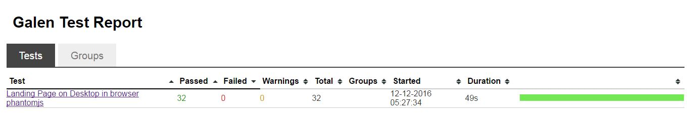
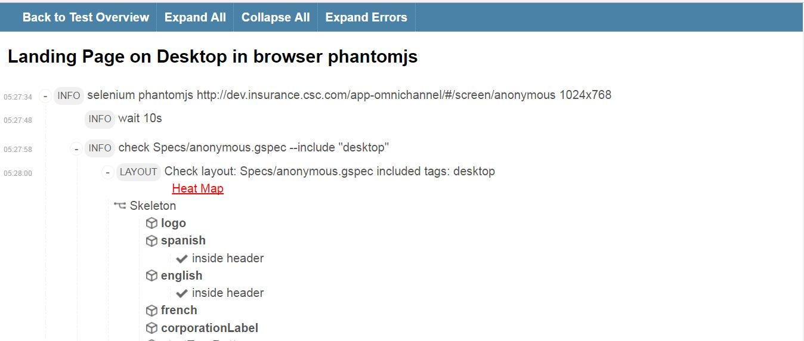
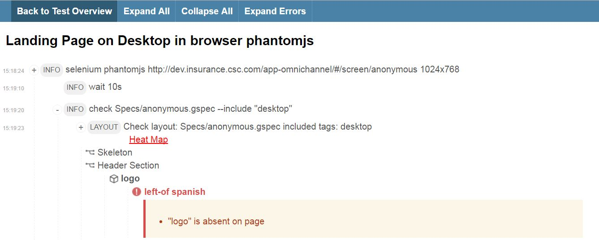
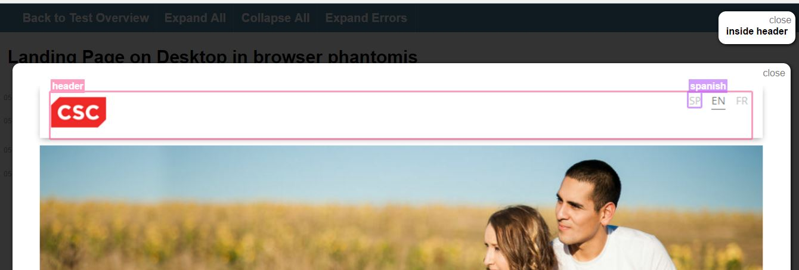

# Writing Galen Scripts

### About Galen
Galen is a test framework originally designed for testing layout of web applications but is also a great tool for functional testing. When it comes to testing a responsive layout it works in a following way:

- Open a page in browser
- Resize it to specified size
- Test the layout according to user-defined specs


It uses Selenium for interacting with elements on page and getting their locations and dimensions. Once it sees that something is wrong – Galen reports the error, makes a screenshot and highlights the misbehaving element on it.

 


### Installation 
```
npm install -g galenframework-cli 
```
You need to have a Java version 1.8 or greater installed on your machine.

### Configuration

Galen allows to configure each project separately. You just need to create a galen.config file in your test project directory or you can run this command
```
galen config
```
and Galen will create a config file for you.

### Writing Galen specs

Using Galen Specs Language you are able to describe any complex layout including different screen sizes or browsers. It's not only easy to write, it is also easy to read it if you are unfamiliar with the language. You can write a proper page spec file and use it later as a requirements document for your Front-end.


 ```
    @objects
    
    div                 xpath   //xpathlocator                 

    logo                xpath    //*[@id="profile-img"]
    

    useridLabel         id    inputUsernameLabel
    useridField         id    inputUsername
    
    passwordLabel       id    inputPasswordLabel
    passwordField       id    inputPassword    
    
   
    loginButton         id      btn_submit
    

    @groups
    div_elements useridLabel,useridField,passwordLabel,
    passwordField,loginButton
    
    = Skeleton =
    &div_elements:
        inside div


    = Main Section =
    
    @on desktop
            div:
                centered horizontally inside screen 

           
            useridLabel:
                aligned vertically left passwordLabel
                above useridField
                
            useridField:
                color-scheme < 100% #FFFE9F
                aligned vertically all  passwordField
                    
            passwordLabel:
                above passwordField
         
            passwordField:  
                color-scheme < 100% #FFFE9F

            loginButton:
                text  is "Login"
          
 ```      
 
 Above specs involve two sub-divisions 
 1. Object Defination -  It is the place where you give names to page objects and also define the so called locators - the way for Galen to find element on test page. 

    Grouping - You can group the objects and categorize them and then to use in checks you have to append it using &
    
 3. Object specs - Based on specs refernce available (http://galenframework.com/docs/reference-galen-spec-language-guide) we can perform various Ui checks like
 
    ```
        passwordLabel:
                    above passwordField
    
    ```
    Sections are declared with = symbol in the beginning and end     of the line. Also in Galen you can have multiple sections        within each other. This allows you to structure your test        code so that it is easier to read it.


There are lot of techniques that can help you optimize your specs. Together with that Galen Framework provides you with rich functionality for visual testing like image comparison and color scheme verification.


### Writing test suites

To give more flexibility and maintainability to user Galen came up with another simple format for defining test suites. Test suites are just a set of pages that needs to be checked with the appropriate test specs. 

```
@@ parameterized
    | url                                                                                 |
    | http://dev.insurance.csc.com/app-omnichannel/#/screen/anonymous                     |
    
@@ parameterized
    | browser  	 |
    | firefox    |
    | phantomjs  |
    | ie         |

@@ parameterized
    | deviceName           | tags        | size     |
    | Mobile Portrait      | mobile      | 411x731  |
    | Tablet Portrait      | tablet      | 768x1024 |
    | Mobile Landscape     | tablet      | 731x411  |
    | Tablet Landscape     | desktop     | 1024x768 | 
    | Desktop      		   | desktop     | 1024x768 |

Landing Page on ${deviceName} in browser ${browser} with ${url}
    selenium ${browser} ${url} ${size}
        wait 10s
    	check  Specs/anonymous.gspec --include "${tags}"
    	run  Pages/anonymous.js
    	wait 10s
    	check  Specs/login.gspec --include "${tags}"

```

Test suite involve sequence of steps that involve selecting of page giving parameters like deviceName, browser,url and size.After launching the page url we can use check command to test our specs, also we can include wait command to add time delay between steps.

Wtihout parameterizing we have to write these tests again for all different devices,browsers. Parametrization will allow us to repeat same test for all different sets of devices and browsers.

### Doing functional tasks using GalenPages

We always have several pages in application and to navigate them we need javascript.GalenPages is a lightweight Selenium javascript framework that allows you to work with Page Objects model in a fast and comprehensive way.

```
this.loginPage = $page("Login Page", {

	userid: "id: inputUsername", // css locator
	password: "id: inputPassword",

	loginButton: "id: btn_submit",

	clickLoginButton: function(userName, password) {
		this.userid.typeText(userName);
		this.password.typeText(password);
		this.loginButton.click();
	}
});
// now you can use it like this

var myloginPage = new loginPage(driver).waitForIt();
myloginPage.clickLoginButton("kkdrensk","kkdrensk");

```

$ Page Returns a function which can be used in order to instantiate the page with all of its primary and secondary fields

### Running tests suites

To run galen tests we have to exectue following command - 

```
galen test mytest.test
    --htmlreport "htmlreport-dir"
```

To run tests on different browsers we need to add one more option as for phantomjs we have - 

```
galen test mytest.test       -Dphantomjs.binary.path=/opt/phantomjs/bin/phantomjs
```

### Generating Report

Galen has very powerful support of generating visual reports that highlights the error and misbehaving elements on the page.


##### Galen overall report


##### Successful case


##### Failure case


##### Visual representation



