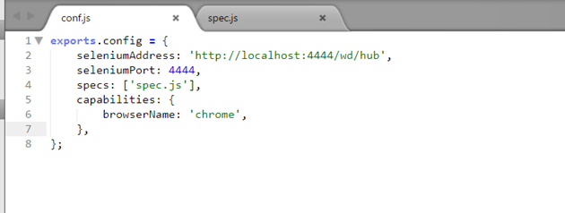
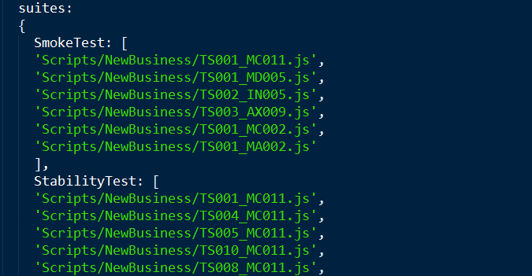
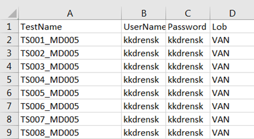
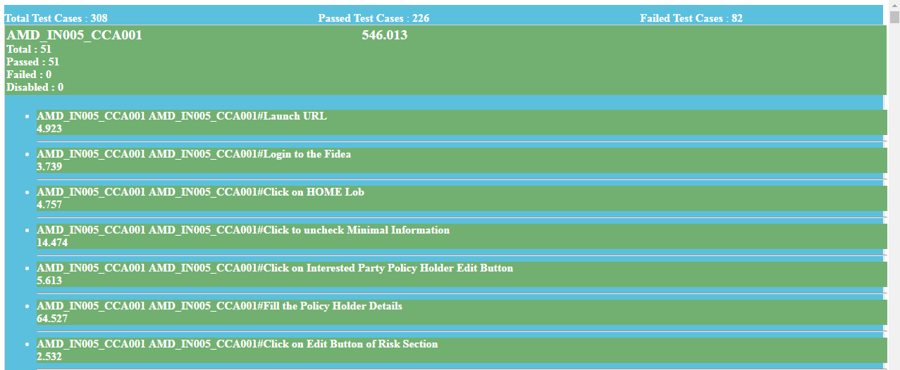

# Writing Protractor Scripts

### About Protractor
Protractor is an end-to-end test framework for AngularJS applications. Protractor runs tests against the application running in a real browser, interacting with it as a user would. It is a Node.js program, and runs end-to-end tests that are also written in JavaScript and run with node.

- Protractor is built on top of WebDriverJS, which uses native events and browser-specific drivers to interact with your application as a user would.
- Protractor supports Angular-specific locator strategies, which allows us to test Angular-specific elements without any setup effort on your part.
- Protractor can automatically execute the next step in test the moment the webpage finishes pending tasks.

### Installation 
```
npm install –g protractor
webdriver-manager update
```
You need to have a Node.js and Java version 1.8 or greater installed on your machine.

### Configuration File
Sample Configuration File

The config file provides path to the test files (spec) also explains all of the Protractor configuration options. The default settings include the standalone Selenium Server, the browser, and the Jasmine test framework.

To run the multiple tests in a bunch a test suite can be defined-
 
A suite can be executed using the following command-
```
protractor conf.js --suite SmokeTest(suite name)
```
### Writing Protarctor specs
Protractor tests are written using the syntax of Jasmine framework and the Protractor API.
![]SpecificationFile.JPG) 

- A test suite begins with a call to the global Jasmine function *describe* with two parameters: a string and a function.
- Specs are defined by calling the global Jasmine function *it*, which, like describe takes a string and a function. 

### Reading Data from External Files
The data is read from the CSV(comma seperated values) files so as to avoid the hardcoded data to the test files.The CSV file can be used to store the data in tabular format and can be viewed as an xls file.The utility file used for reading the data from CSV is CSV_Processor.js.A sample CSV file -
 

### Running Test Cases
To run the test files(specs) following steps can be followed-
- Run the Selenium Server 
```
webdriver-manager start
```
The command will start up the selenium server so that the protractor tests can send requests to this server inorder to control the local browser.
- Now to run the test cases
```
protractor conf.js
```
### Generating Report
The protractor tests execution results are generated in the form of HTML file.The reports are located at root folder in functionalReports.The configuration to the report generation is specified in conf.js which internally make use of fileWriter and htmlReporter.js as a utility file.

 
A visual representation of the report can be seen in the below screenshot. It shows the total number of tests(specs) executed, number of passed and failed spec. A detailed description of each test can be viewed by clicking on the testcase name.
 

#### Checking Performance 
The performance of the tests is measured by capturing the timing of each test step i.e..the *it* block of the spec files.The timing is recored in CSV files that can be located in the Perf folder under tests.CSV_Processor.js and jasminePtorFailFast.js are the utility files used for recording time.
A sample performance file -
 

