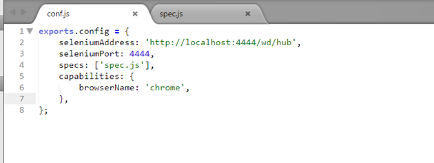
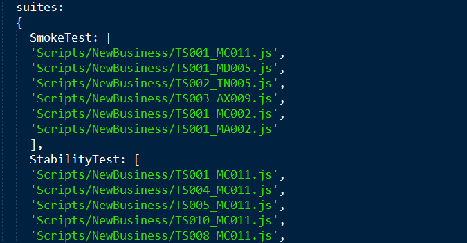
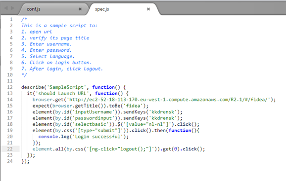
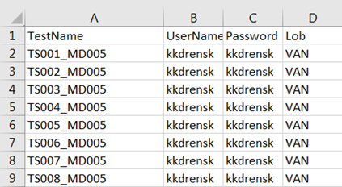
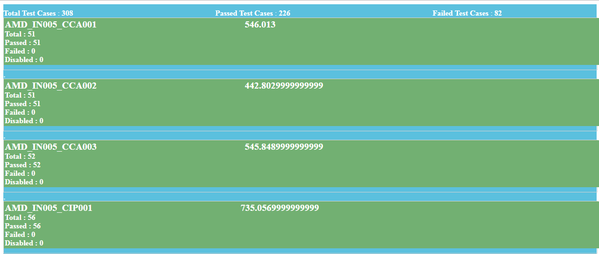
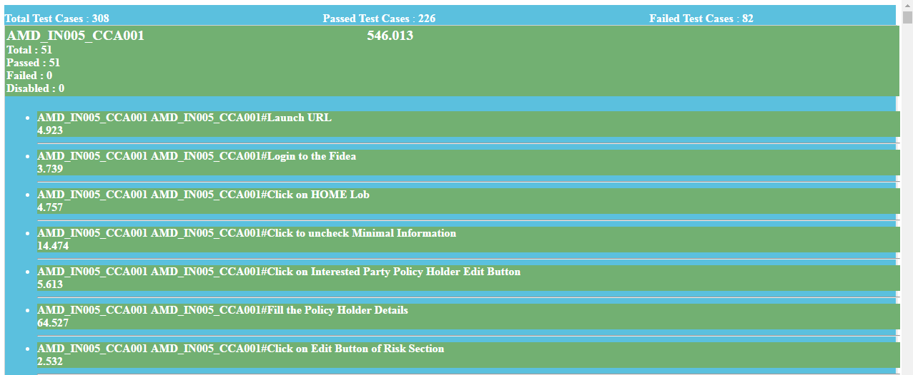
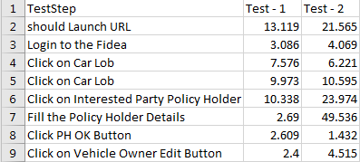

# Writing Protractor Scripts

### About Protractor
Protractor is an end-to-end test framework for AngularJS applications. Protractor runs tests against the application running in a real browser, interacting with it as a user would. It is a Node.js program, and runs end-to-end tests that are also written in JavaScript and run with node.

- Protractor is built on top of WebDriverJS, which uses native events and browser-specific drivers to interact with your application as a user would.
- Protractor supports Angular-specific locator strategies, which allows us to test Angular-specific elements without any setup effort on your part.
- Protractor can automatically execute the next step in test the moment the webpage finishes pending tasks.

### Installation 
The prerequisite for Protractor installation is to have Node.js and Java version 1.8 or greater installed on your machine.
Use npm to install Protractor globally with:
```
npm install –g protractor
```
The above command installs two tools Protractor and webdriver-manager.The webdriver-manager is a helper tool to easily get an instance of a Selenium Server running.To update the webdriver-manager use the command-
```
webdriver-manager update
```
### Configuration File
The config file provides path to the test files (spec) also explains all of the Protractor configuration options. The default settings include the standalone Selenium Server, the browser, and the Jasmine test framework.

Sample Configuration File



The properties of config object are as follows-
- seleniumAddress - Connect to a running instance of a standalone Selenium Server. The address will be a URL.
- seleniumPort - The port is used to start the standalone Selenium Server. If not specified, defaults to 4444.
- seleniumArgs - Array of command line options to pass to the server. For a full list, start the server with the -help flag.
- Capabilities - The browser and browser instances details are given in capabilities.

To run the multiple tests in a bunch a test suite can be defined-

 

A suite can be executed using the following command-
```
protractor conf.js --suite SmokeTest(suite name)
```
### Writing Protarctor specs
Protractor tests are written using the syntax of Jasmine framework and the Protractor API.

 

- A test suite begins with a call to the global Jasmine function *describe* with two parameters: a string and a function.The covention followed for writing the first parameter in *describe* block is the TestCase Name.
- Specs are defined by calling the global Jasmine function *it*, which, like describe takes a string and a function.For the *it* block the first parameter is the relevant test step description.

### Reading Data from External Files
The testdata is kept and read from the CSV(comma seperated values) files.The CSV file can be used to store the data in tabular format and can be viewed as an xls file.The file provides an ease to change and update the testdata multiple times.The utility file used for reading the data from CSV is CSV_Processor.js.A sample CSV file -

 

### Running Test Cases
To run protractor tests we need to open two windows of git bash one for starting the server and the other for running the test.

- For running the Selenium Server 
```
webdriver-manager start
```
The command will start up the selenium server so that the protractor tests can send requests to this server inorder to control the local browser.
- Now to run the test cases
```
protractor conf.js
```
The second parameter to the above command is the path to the respective configuration file.

### Generating Report
We have added support for reporting protractor tests execution results.The report is in HTML file format and can be located in functionalReport folder of the project(root folder).The configuration to the report generation is specified in conf.js which internally make use of fileWriter and htmlReporter.js as a utility file.

 

A visual representation of the report can be seen in the below screenshot. It shows the total number of tests(specs) executed, number of passed and failed spec. A detailed description of each test can be viewed by clicking on the testcase name.

 

#### Checking Performance 
The reports and the Performance CSV files allows us to check and measure the performance time of our application.The performance of the tests is measured by capturing the timing of each test step i.e..the *it* block of the spec files.The timing is recored in CSV files that can be located in the Perf folder under tests.CSV_Processor.js and jasminePtorFailFast.js are the utility files used for recording time.
A sample performance file -

 
