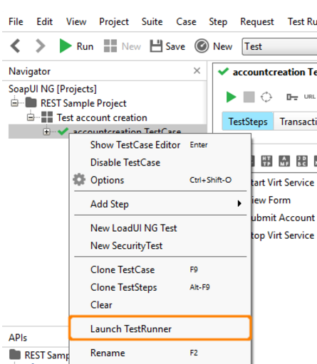

# API testing

ReadyApi helps to capture and test the response time individual APIs takes and as combined with others the whole time taken. It also tests the load an API can handle.

There are two ways to capture the API&#39;s in ReadyAPI tool.

1. Manually creating a new project and copying the API&#39;s from the browsers network tab.
2. Using the inbuilt browser of this tool.

**Manually creating a new Project:**

1. On READY API tool open **Projects** section, where first save API calls.

  

2. Click on NEW Project under the FILE Menu. After filling the url and other fields this will get created on the left hand side. Rename it as required. Under this **testsuite** is created with the url mentioned while creating the project.

**On Projects Section: Creation of New Test Case/Resource:**

3. Click on Create New Resource -&gt; Paste the API URL of the call which needs to be tested.

 

4. Once the resource is created, click on the + symbol to expand the resource and find its method and request.
5. Rename the resource name, request name and the method to identify easily.
6. Double click on the Request name and see the details of that call on the right section of the page.

 

7. Check for the type of call it is – GET or POST or PATCH (see the highlighted area in the below fig.)

 

8. Double check the ENDPOINT. (see the end point in the above figure beside the highlighted &quot;METHOD&quot;)
9. Check for the resource values and its parameters.

There are four VERTICAL TABS – &quot;Form&quot;, &quot;Outline&quot;, &quot;RAW&quot;, &quot;Request&quot;.

 

10. Click on Request tab and look for a small add button &quot;+&quot; to add all parameters to this call (see this add button beside the tab &quot;Request&quot; highlighted).
11. Add the mandatory parameters in this section. The parameters are those which are required to hit the API. The style of parameters can be header, template, query.
12. The value of the parameters can be placed here if they have constant value like for HEADERS. But for the dynamic value of any parameters first store it in some variable and then access it.

**Using the inbuilt browser:**

1. Go to Projects. Open the Discovery API from project tab.

 

2. Copy paste the application URL here and press enter. Traverse application from here, READY API will capture the API&#39;s in the background.
3. After completing press DONE as shown in the figure. Number of recorded request can be seen beside the DONE button.

 

4. After done there will be all recorded requests. Select only the ones which can API requests and unselect the rest.
5. Click on Generate Services.

 

6. This way all the REST requests are captured in PROJECT section.

**SOAP UI NG: Creation of Project**

On the SoapUI part, don&#39;t create call conversions directly, use the call Methods created in Projects section to be converted here.

 

1. Click on the NEW PROJECT -&gt;Save with all the details to be required.
2. Create a NEW TESTSUITE to be under this project and rename it as required.
3. Right click on this TestSuite and select NEW TESTCASE and rename it as required.

 

**Creation of REST Request on SOAPUI**

1. Right Click on the project&#39;s testsuite name and select ADD STEP.
2. Select REST Request and Rename it
3. A list of methods with their requests are shown which can be selected to invoke in the SOAP UI section. This list is from the PROJECTS section where each resource was created directly entering the URLs.
4. Once the resource is created, see in the middle section, the request parameters with their names and input fields for entering the values.
5. **There are 4 levels of variables in SoupUI:**

- Global variables or environment variables. These are created from environment tab.
- TestSuite level variables: These are available for that particular test suite.
- TestCase Level: These will be available for test cases.
- Test Step Level: These will be only available for that particular step.

6. Parameters value depend on the variables in which it is stored.

**Groovy Script on SoapUI**

 

1. This script is used to run through the responses of API calls and pick out some data which is required for consecutive calls.

For e.g.: We want some response data from previous call, we can take that data with the help of groovy script and store it in any level of variable.

2. **Sequence of scripts** should be maintained with care, while writing groovy scripts.

**Creation of groovy script:**

1. Click on SoapUI NG tab and go to the current project and right click on the name. (check in the above figure.)
2. Select &quot;Add Step&quot; and click on &quot;Groovy Script&quot; option on the list.
3. Rename the script and write the content of the script to capture a value for a parameter being questioned.
4. Use log.info () to see the scripts execution line by line.

**Run the Test Suite**

Double click on the test case under the test suite &quot;CarQuoteOCPerfAndDev&quot; and the whole list of test cases are displayed in the middle section. Find a RUN symbol (green triangle) to start executing the calls. And see the progress on the Green Progress BAR which also shows the current running script. After the whole test cases in test suite are finished successfully- it shows FINISHED with GREEN bar or else it will be a RED bar with FAILED displayed.

Click on any test step in the list below to view the response of API call on the right section of that test case view.

 

 

**Save the testCase result:**

1. To save the result of generate test case go to Transaction Log beside overview icon.
2. Click on &quot;create a report for this item&quot; icon as shown in the figure.

 

3. A .pdf file will be generated which can be saved as local machine.

**LOADUI Test Cases Creation:**

1. From SoapUI – Right click on the TestSuite.  Select &#39;New LoadUI NG Test&#39;.

 

2. It will then create/process/switch to LoadUI.
3. From LoadUI – On left, double click on the LoadUI Test Suite that needs to be execute.

 

4.  On middle screen – click on New Scenario button

 

5. Set the Test Time (how much time the load should be applied). Ex 20mins.  Need to set number and units.

 

6. On the Right – In the New Scenario section are the options to be set to run the test under load.
7. First off – Load Profile should be set to RAMP UP (there are multiple load profile to choose according to the requirements).
8. Base VUs – 1 (instead of starting at zero)
9. Peak VUs – 200 (Or whatever value want to hit, on current ReadyAPI server 200 seems to be limit)
10. Ramp Duration – 18 mins – Pick a number that is less than the whole test time.  The idea is that the test would get to 200 VU in 18 minutes, then still have 2 more minutes to run at full VU.  Otherwise if Total Time = Ramp up time, there would not be a time that 200 VUs are being tested.
11. Press &#39;play&#39; button to run the test.

 

12. It will run for the 20 minutes.  Do not try to do anything else on the server while the test is running.
13. Once the test has completed running you will be able to process the results.
14. Select the Statistics button.  Then note &#39;RUN&#39; section has a date next to it.  You can pick the &#39;run&#39; that you want to analyze.
15. Note the button to the right of Run – Looks like graph with an upward trend.  That is the button used to create a new graph.  Select that button

 

16. Creating a graph.

 

17. This the default when adding a Statistic to view.
18. It&#39;s recommend to &#39;Remove All&#39; for the default statistics.
19. Then expand Load Test Statistics – Select Running VU

 

20. That adds the running count of VUs.
21. Now collapse Load Test Statistics and Expand Scenarios, expand new Scenario, expand Test Steps
22. Note the list of steps is an alphabetically listing of the APIs and Groovy scripts from the SoapUI test suite.

 

23. Expand the API that needs to be analyzed.
24. Select the properties that needs to be shown on graph.
25. Select OK – Scroll to the bottom of the Statistics section to see the new graph.
26. Note it might be BLANK.  Just double click on it and select OK again.
27. Right click on the Graph name and rename to the API name.

 

28. Use the mouse to compress the graph to see the whole table to view across the entire time line.

 

29. Once all the graphs have been created that you want to view.  You can create a PDF that can show those.
30. On the Statistics row select the Report button

 

 

31. Select OK
32. PDF is generated – Just save the PDF.

**Run Soap test and Load test from command line.**

**SoapUI test:**

1. In SoapUI NG, select Project | Launch TestRunner from the main menu.

 

2. In SoapUI NG, right-click the desired TestCase and select Launch TestRunner

 

3. Ready! API displays a dialog box, where parameters can be configured.

 

4. See the test log.

 

5. After the run finishes, find the generated command line at the beginning of the test log.

 

6. Run this command from the command line at the location where testrunner.bat is located. It is generally located in ReadyApi bin directory.

**LoadUI Test:**

1. In LoadUI NG, select the launch command from the Navigator&#39;s context menu.

 

2. Repeat the steps as mentioned in SoapUI test.
3. Run this command from the command line at the location where loadtestrunner.bat is located. It is generally located in ReadyApi bin directory.